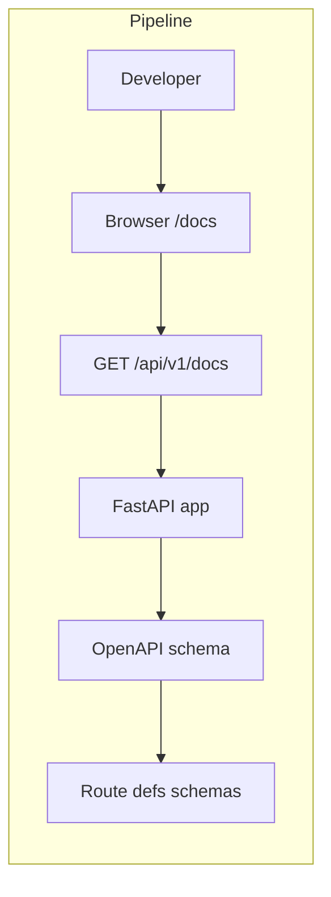

# API Documentation

## Initiator

- **Who:** Developer (browse and test API). No user action in product flow.
- **When:** Open `/api/v1/docs` or `/docs` in browser.

## Frontend flow

- **Screen/Widget:** N/A (Swagger UI is served by backend). Redirect from `/docs` to `/api/v1/docs` if configured.
- **User action:** Developer visits docs URL; explores endpoints, tries requests (auth via Bearer if supported in Swagger).
- **API calls:** Swagger UI fetches OpenAPI JSON from backend (same origin or configured); no product API call from app for "docs."

## Backend routing

- **Entry:** FastAPI app automatically serves OpenAPI schema and Swagger UI. Mount at `/api/v1/docs` (or root `/docs` via redirect in main.py).
- **Handler:** FastAPI built-in: openapi_url, docs_url. No custom handler.

## Service layer

- N/A. OpenAPI generated from route decorators, request/response models, and tags.

## Models and DB

- None. Docs are generated from Pydantic schemas and route signatures.

## Dependencies

- **Requires:** None (docs are read-only view of API). All feature endpoints appear in docs if registered on app.
- **Triggers / side effects:** None.

## Flow diagram

## Vulnerabilities

- Swagger UI in production: consider disabling in production or protecting (e.g. admin-only, or read-only). Avoid exposing internal endpoints or secrets in examples. No PII in default schema.
- Rate limit and auth (Bearer) should be documented or visible in Swagger so developers know how to test.

## Improvements

- Add tags and descriptions to route groups (auth, events, tickets, admin, etc.) for clearer navigation. Document rate limits and error responses (429, 403) in OpenAPI if possible.
- Optional: export OpenAPI JSON for client generation (e.g. Dart/Flutter client from OpenAPI spec).

## Feedback

- Single place for API reference; FastAPI default is sufficient for internal and partner use. Keep schema in sync with actual request/response (Pydantic models).
