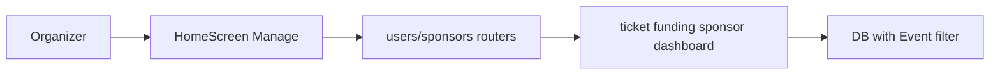

# Organizer Dashboard Filters (Genre and Event)

## Initiator

- **Who:** Organizer or admin viewing the Manage tab dashboard.
- **When:** Dashboard is loaded with optional status/genre/event filters; tapping a KPI card navigates to the corresponding list with the same filters applied.

## Frontend flow

- **Screen/Widget:** `HomeScreen` (Manage tab) with dashboard KPI cards and filter chips. Destination screens: `GlobalTicketSalesScreen`, `OrganizerPledgesScreen`, `OrganizerSponsorsScreen`, event detail or Explore tab for Total Events.
- **User action:** Select status, genre, or a single event; tap a KPI card to open the filtered list or event detail.
- **API calls:** `getOrganizerTicketSales()`, `getOrganizerPledges()`, `getOrganizerSponsors()` with optional `event_status`, `genre`, `eventId`. Dashboard uses `getOrganizerDashboard()` with the same filter params.

## Backend routing

- **Entry:** `users.router` and `sponsors.organizer_views.router`.
- **Handler:** `get_my_organizer_ticket_sales()`, `get_organizer_pledges()` in `users.py`; `list_organizer_sponsors()` in `organizer_views.py`. All accept `genre`, `event_id` and filter via Event join.

## Service layer

- **Module(s):** `app.services.ticket.sales`, `app.services.funding.pledges`, `app.services.sponsor.organizer_queries`, `app.services.dashboard`.
- **Main functions:** `list_organizer_ticket_sales(..., genre=, event_id=)`, `list_organizer_pledges(..., genre=, event_id=)`, `get_organizer_sponsors(..., genre=, event_id=)`, `get_organizer_dashboard(..., genre=, event_id=)`.

## Models and DB

- **Models:** `TicketSale`, `Funding`, `SponsorBid`, `Event`. No new tables.
- **Tables updated/read:** `ticket_sales`, `fundings`, sponsor tables, `events`. Filters use JOIN to `events` and WHERE on `events.genre` and `events.id`.

## Dependencies

- **Requires:** [Auth](01-auth-users.md) (organizer or admin). Touches [Tickets](19-tickets.md), [Funding](09-funding-pledges.md), [Enhanced Sponsor Info](36-sponsor-info-organizers.md).
- **Triggers / side effects:** None. Read-only filtering.

## Prompt

Implement **Organizer Dashboard Filters** for the Crowd Funding Event app. Backend: get_organizer_dashboard, list_organizer_ticket_sales, list_organizer_pledges, get_organizer_sponsors accept optional event_status, genre, event_id and filter via Event join. Frontend: Manage tab dashboard with filter chips (status, genre, event); KPI cards navigate to filtered lists. Follow the flow, dependencies, and diagrams in this document.

## Flow diagram

## Vulnerabilities

- Ensure genre and event_id are validated; backend scopes by organizer_id so organizers cannot see others' data.

## Improvements

- Show active filter summary in app bar of destination screens (e.g. "Genre: Music").

## Feedback

- Filters propagate end-to-end; organizer can drill from dashboard into ticket sales, pledges, or sponsors for the same filtered set.