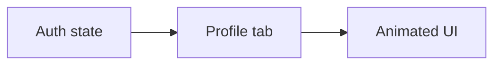

# Sign-Out Animation

## Initiator

- **Who:** User who has just signed out.
- **When:** Profile tab is visible and the authenticated user becomes null (after logout or token expiry).

## Frontend flow

- **Screen/Widget:** `HomeScreen` profile tab (`_buildProfileTab()`). When `user == null`, shows animated sign-out state instead of static "Not signed in" text.
- **User action:** None (state-driven). Profile tab reflects post-logout state.
- **API calls:** None for the animation. Auth state from [Auth](01-auth-users.md) provider.

## Backend routing

- N/A. Purely frontend presentation.

## Service layer

- N/A.

## Models and DB

- None.

## Dependencies

- **Requires:** [Auth](01-auth-users.md). Uses `flutter_animate` for scale, fade, slide effects.
- **Triggers / side effects:** None.

## Flow diagram

## Vulnerabilities

- None. Cosmetic only. Animation should not block or delay actual sign-out.

## Improvements

- Optional: brief "Signed out" confirmation or redirect after a short delay.

## Feedback

- Replacing "Not signed in" with sign-out animation improves perceived polish.