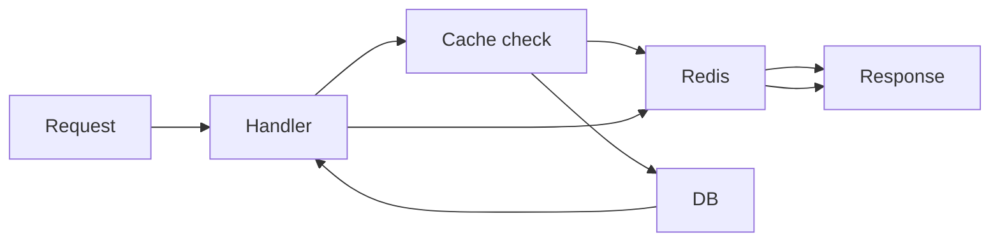

# Redis Caching Layer

## Initiator

- **Who:** System (every request to cached endpoints).
- **When:** GET requests to featured events, event detail, organizer dashboard; every platform setting read via get_int/get_bool/get_str. Cache init on app startup; close on shutdown.

## Frontend flow

- **Screen/Widget:** N/A (transparent). Frontend calls the same API; responses may be served from cache or DB.
- **User action:** N/A.
- **API calls:** Unchanged. GET `/events/featured`, GET `/events/{id}`, GET `/me/organizer-dashboard`, and endpoints that read platform settings benefit from backend cache.

## Backend routing

- **Entry:** `main.py` lifespan: `init_cache()`, `close_cache()`. Cache used inside route handlers and in `platform_settings._get_raw()`.
- **Handler:** Handlers for featured, event detail, dashboard check cache first; on miss, run logic and `cache_json_set()`. Platform settings: `_get_raw()` uses `cache_get("settings:{key}")` and `cache_set()`. Invalidation: `cache_delete("event:{id}")`, `cache_delete_pattern("featured:*")` on event update/lifecycle; `cache_delete("settings:{key}")` on set_value.

## Service layer

- **Module(s):** `app.cache` (init_cache, close_cache, cache_get, cache_set, cache_delete, cache_delete_pattern, cache_json_get, cache_json_set; _enabled and set_cache_enabled).
- **Main functions:** All ops check `_enabled` and `_client`; when disabled or Redis down, get returns None and set is no-op. Graceful degradation.

## Models and DB

- **Models:** None. Redis key-value; JSON serialized for JSON helpers.
- **Tables updated/read:** Cache reduces DB reads for settings, featured, event detail, dashboard. No schema change.

## Dependencies

- **Requires:** Redis (optional; same URL as ARQ). [Feature Flags](12-feature-flags.md), [Events](03-events-crud-lifecycle.md), [Admin Dashboard](28-admin-dashboard.md). [Cache TTL and toggle](50-cache-ttl-admin-toggle.md) control TTLs and enable/disable.
- **Triggers / side effects:** Admin settings list (get_all_with_descriptions) is not cached.

## Flow diagram

## Vulnerabilities

- Use TLS for Redis in production if remote. Avoid user-controlled input in cache keys. Admin-only data keyed by organizer_id.

## Improvements

- Consider cache stampede protection. Optionally add Redis to health check. Document key naming and TTLs.

## Feedback

- Cache-aside with short TTLs and invalidation on write cuts DB load for featured, event detail, dashboard, and settings. Graceful degradation when Redis unavailable.