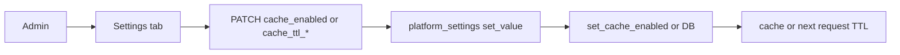

# Cache TTL and Enable/Disable in Admin Settings

## Initiator

- **Who:** Admin (edit platform settings); System (read TTLs and cache_enabled on every cached request or at startup).
- **When:** Admin Dashboard Settings tab; app startup (bootstrap cache_enabled); every cache read/write.

## Frontend flow

- **Screen/Widget:** `AdminDashboardScreen` Settings tab. Keys cache_ttl_* and cache_enabled are listed and editable; admin UI auto-renders from GET `/admin/settings`.
- **User action:** Admin sets cache_enabled to true/false or edits cache_ttl_settings, cache_ttl_featured, cache_ttl_event_detail, cache_ttl_dashboard (seconds). Toggle takes effect immediately.
- **API calls:** GET `/admin/settings`, PATCH for individual setting. Same as [Feature Flags](12-feature-flags.md) and [Admin Dashboard](28-admin-dashboard.md).

## Backend routing

- **Entry:** `admin.router`; settings read in dashboard, featured, event detail, users endpoints.
- **Handler:** `set_value()`: when key is `cache_enabled`, calls `set_cache_enabled(value.lower() == "true")`. TTLs read via `get_int(db, "cache_ttl_*")` in featured, event detail, dashboard handlers.

## Service layer

- **Module(s):** `app.services.platform_settings`, `app.cache`.
- **Main functions:** DEFAULTS/DESCRIPTIONS include cache_enabled, cache_ttl_settings, cache_ttl_featured, cache_ttl_event_detail, cache_ttl_dashboard. `_get_raw()` uses `DEFAULTS["cache_ttl_settings"]` for settings key TTL. Main lifespan loads cache_enabled from DB and applies `set_cache_enabled()`.

## Models and DB

- **Models:** `PlatformSetting`. No new tables.
- **Tables updated/read:** `platform_settings`. New keys stored as strings (e.g. "300", "true").

## Dependencies

- **Requires:** [Redis Caching](49-redis-caching.md), [Feature Flags](12-feature-flags.md), [Admin Dashboard](28-admin-dashboard.md).
- **Triggers / side effects:** cache_enabled disables or re-enables cache in-process. TTLs affect subsequent cache_set. Admin settings list is not cached.

## Flow diagram

## Vulnerabilities

- Only admin can change settings. Incorrect TTL could serve stale data longer; cache_enabled=false is safe.

## Improvements

- Validate TTL range and cache_enabled as boolean in PATCH. Document in admin UI that cache_enabled takes effect immediately.

## Feedback

- Single place to tune or disable cache without deploy. Useful for debugging or tuning TTLs in production.