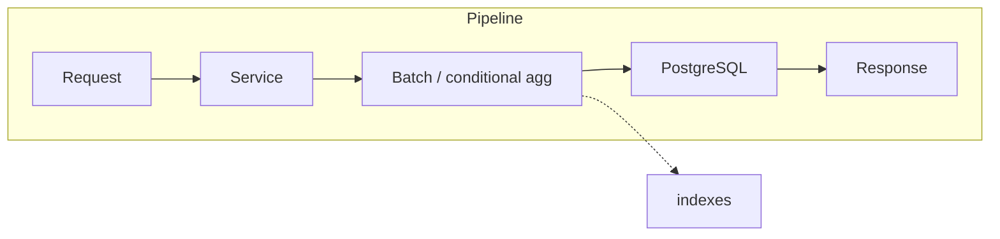

# Backend Query Improvements

## Initiator

- **Who:** System (every request that hits dashboard or organizer list endpoints); Ops (run migrations).
- **When:** Organizer dashboard load; organizer ticket sales, pledges, sponsors lists; ticket purchase; pledge create/preview; sponsor bid and event queries.

## Frontend flow

- **Screen/Widget:** N/A (transparent). Same API contracts; responses may be faster due to fewer DB round-trips and better index usage.
- **User action:** N/A.
- **API calls:** Unchanged. GET `/me/organizer-dashboard`, GET ticket sales/pledges/sponsors, POST purchase/pledge, etc., benefit from consolidated queries and indexes.

## Backend routing

- **Entry:** Same routes as before. No new endpoints; handlers call refactored services.
- **Handler:** Dashboard handler calls `get_organizer_dashboard()` (fewer queries). Ticket, funding, sponsor list and detail handlers call services that batch-fetch instead of looping.

## Service layer

- **Module(s):** `app.services.dashboard`, `app.services.ticket.sales`, `app.services.funding.pledges`, `app.services.funding.reservations`, `app.services.sponsor.organizer_queries`.
- **Main functions:** Dashboard: conditional aggregation (func.count().filter(), func.sum(case(...))) for TicketSale, Funding, SponsorPayment, sponsors, events in single queries. Ticket sales: batch reload with TicketSale.id.in_(sale_ids) and selectinload. Pledges: get_reserved_spots_for_tiers(), batch tier fetch. Sponsor: batch profiles and users for get_organizer_sponsors; batch bids/categories for get_sponsor_events_for_organizer and get_sponsor_bids_detail_for_admin.

## Models and DB

- **Models:** TicketSale, Funding, SponsorBid, SponsorTicket, SponsorPayment, SponsorshipCategory, Bookmark (indexes only). No new columns; composite and single-column indexes added via migration.
- **Tables updated/read:** ticket_sales, fundings, sponsor_*, bookmarks. New indexes: status, FKs, (event_id, status), (event_id, created_at) where specified; bookmarks event_id (user_id index already existed).

## Dependencies

- **Requires:** Alembic migration `yy02y1z2a3b4_add_missing_indexes` applied. Touches [Tickets](19-tickets.md), [Funding](09-funding-pledges.md), [Enhanced Sponsor Info](36-sponsor-info-organizers.md), [Admin Dashboard](28-admin-dashboard.md) (organizer dashboard). No change to [Redis Caching](49-redis-caching.md) behavior.
- **Triggers / side effects:** None. Same result sets; fewer queries and better plan usage. Downgrade migration drops only indexes created by this migration (e.g. not ix_bookmarks_user_id, which belongs to bookmarks table migration).

## Prompt

Implement **Backend Query Improvements** for the Crowd Funding Event app. Backend: get_organizer_dashboard with conditional aggregation in fewer queries; ticket sales batch reload with selectinload; pledges batch tier and reserved spots; sponsor batch profiles and users; add composite and single-column indexes via migration (status, FKs, event_id plus status/created_at, bookmarks event_id). No API or frontend change. Follow the flow, dependencies, and diagrams in this document.

## Flow diagram

## Vulnerabilities

- Migration must be idempotent where indexes might already exist (e.g. skip or if_not_exists for ix_bookmarks_user_id). Ensure consolidated aggregates match previous semantics (same filters, same status sets) to avoid regression.

## Improvements

- Add query timing or slow-query log for dashboard to monitor impact. Consider read replica for dashboard if primary is still under load after optimization.

## Project backend rules (N+1 and DB routing)

- **CLAUDE.md** at the repo root (and `.cursor/rules/`) documents backend conventions: (1) avoid N+1 by eager-loading relationships with `selectinload` / `joinedload` / `subqueryload`; (2) classify new endpoints as read-only vs write/coupled and use `ReadDbSession` for read-only and `DbSession` for writes. These rules apply to all backend code under `Backend/app` and should be followed when adding or changing API handlers and services.

- **MCP validation rules (CLAUDE.md):** After Flutter/Dart changes (`FrontEnd/lib/**/*.dart`), use the Dart MCP server to run `dart analyze` on changed files and fix errors/warnings. After database-related changes (migrations, model changes, query changes), use the PostgreSQL MCP server to validate schema and queries (e.g. confirm tables/columns exist after migrations).

## Feedback

- Dashboard drops from ~30 to ~8–10 queries; N+1 removed in organizer sponsors, ticket purchase, pledge preview/create, and sponsor admin flows. Indexes reduce full table scans on status and event_id filters.