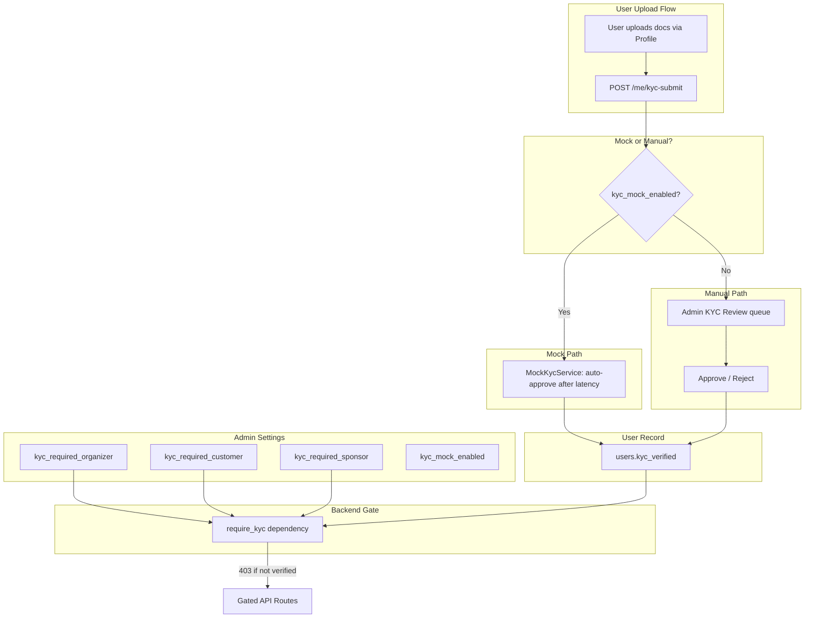

# KYC/AML Verification (Per-Role Toggles)

## Initiator

- **Who:** Organizer, Customer, or Sponsor (uploads identity documents and submits for verification); Admin (reviews pending submissions, approves or rejects; toggles KYC requirements per role via platform settings); System (blocks role-specific actions when KYC is required but user is not verified).
- **When:** User navigates to Profile -> Identity Verification section; Admin enables `kyc_required_organizer` / `kyc_required_customer` / `kyc_required_sponsor` in Settings -> KYC group; user attempts a gated action (create event, purchase ticket, place bid) without verification.

## Frontend flow

- **Profile Screen -> Identity Verification section** ([`FrontEnd/lib/screens/profile/profile_screen.dart`](FrontEnd/lib/screens/profile/profile_screen.dart), widget [`FrontEnd/lib/widgets/kyc_section.dart`](FrontEnd/lib/widgets/kyc_section.dart)): Shows current KYC status (not_started, submitted, verified, rejected). **Redesign:** Expandable accordion, role-based document lists, section starts collapsed; passport/DL hint on government ID rows. Upload button per document type (file picker: jpg, png, pdf). **Web:** KYC document upload uses bytes (MultipartFile.fromBytes, FilePicker with bytes) so upload works on Flutter web. Delete button for pending documents. "Submit for Verification" button (enabled when required docs uploaded). Shows rejection reasons if rejected. Section is hidden for admin users. **UX:** Accordion stays expanded after upload/delete (_expanded state + initiallyExpanded); after upload, local state is updated by splicing new KycDocument from API response into _kycData (no full reload); after delete, document is filtered out of _kycData locally — avoids loading flicker and collapse. Submit still triggers full reload since KYC status changes.
- **KYC Required Banner** ([`FrontEnd/lib/widgets/kyc_required_banner.dart`](FrontEnd/lib/widgets/kyc_required_banner.dart)): Shown on organizer dashboard ([`home_screen.dart`](FrontEnd/lib/screens/home/home_screen.dart)), customer home ([`tabs/home_tab.dart`](FrontEnd/lib/screens/home/tabs/home_tab.dart)), and sponsor manage tab ([`tabs/sponsor_manage_tab.dart`](FrontEnd/lib/screens/home/tabs/sponsor_manage_tab.dart)) when user is not verified (`kycStatus != 'verified'`). Optional `action` string customizes the message (e.g. "create and manage events", "purchase tickets and register for events", "place sponsorship bids"). Tapping "Verify" navigates to `/profile`.
- **Admin Settings -> KYC group** ([`admin_settings_tab.dart`](FrontEnd/lib/screens/admin/tabs/admin_settings_tab.dart)): Expansion group "KYC" with toggles for `kyc_required_organizer`, `kyc_required_customer`, `kyc_required_sponsor`, `kyc_mock_enabled`, and numeric settings for mock latency and failure rate.
- **Admin -> KYC Review tab** ([`admin_kyc_tab.dart`](FrontEnd/lib/screens/admin/tabs/admin_kyc_tab.dart)): Lists users with `kyc_status == "submitted"`. Each card shows user info (name, email, role, document count). Expandable to show uploaded documents with type, filename, and status. Approve / Reject buttons (reject opens reason dialog). On action, refreshes list and shows snackbar.
- **User model** ([`FrontEnd/lib/models/user.dart`](FrontEnd/lib/models/user.dart)): `kycStatus`, `kycVerified`, `kycVerifiedAt`; populated from `GET /me` and `GET /me/kyc-status`.
- **API calls:**
  - `GET /me/kyc-status` -> `KycStatusResponse`
  - `POST /me/kyc-documents` (multipart: file + document_type) -> `KycDocumentResponse`
  - `DELETE /me/kyc-documents/{id}`
  - `POST /me/kyc-submit` -> `KycSubmitResponse`
  - `GET /admin/kyc-pending` -> `list[KycPendingUser]`
  - `GET /admin/users/{id}/kyc-documents` -> `list[KycDocumentResponse]`
  - `POST /admin/users/{id}/kyc-verify` (body: `{approved, rejection_reason}`)
- **GET /me** response includes `kyc_status`, `kyc_verified`, `kyc_verified_at` for all roles.

## Backend routing

- **User KYC:** `app/api/v1/users.py` -- `GET /me/kyc-status`, `POST /me/kyc-documents`, `DELETE /me/kyc-documents/{id}`, `POST /me/kyc-submit`.
- **Admin KYC:** `app/api/v1/admin.py` -- `GET /admin/kyc-pending`, `GET /admin/users/{user_id}/kyc-documents`, `POST /admin/users/{user_id}/kyc-verify`.
- **KYC Gate:** `app/dependencies.py` -- `require_kyc()` dependency applied to: create event, purchase ticket, register for event, pledge, place bid, pay bid.

## Service layer

- **Module:** `app/services/kyc_verification.py`
- **ABC:** `KycVerificationService` with `verify_submission(db, user_id) -> KycResult`.
- **Mock:** `MockKycVerificationService` -- auto-approves after configurable latency (`mock_kyc_latency_min_ms`/`max_ms`); configurable failure rate (`mock_kyc_failure_rate_percent`) with realistic failure reasons (document_unreadable, name_mismatch, expired_id, address_mismatch, blurry_selfie).
- **Stub:** `StripeIdentityKycService` -- raises `NotImplementedError` (future: Stripe Identity VerificationSession).
- **Factory:** `get_kyc_service(db)` -- returns mock when `kyc_mock_enabled` is true, else Stripe stub.
- **Document management:** `upload_document()`, `delete_document()`, `list_documents()`, `submit_for_review()` (validates required docs, calls mock or marks for admin review), `admin_verify()` (approve/reject with notifications), `list_pending_users()`.
- **Required documents:** `id_front` + `proof_of_address` (minimum). Optional: `id_back`, `selfie`, `tax_id`.

## Models and DB

- **User model** (`app/models/user.py`):
  - `kyc_status: str` -- "not_started" | "submitted" | "under_review" | "verified" | "rejected" (default: "not_started")
  - `kyc_verified_at: datetime | None`
  - `kyc_verified: bool` (computed property: `kyc_status == "verified"`)
- **KycDocument model** (`app/models/kyc_document.py`):
  - `id`, `user_id` (FK users), `document_type` (Enum: id_front, id_back, proof_of_address, selfie, tax_id), `file_path`, `mime_type`, `original_filename`, `status` (Enum: pending, approved, rejected), `rejection_reason`, `submitted_at`, `reviewed_at`, `reviewed_by_id` (FK users).
- **Notification types:** `kyc_submitted`, `kyc_approved`, `kyc_rejected`.
- **Migration:** `hhh_kyc_verification.py` -- adds `kyc_status` + `kyc_verified_at` to `users`, creates `kyc_documents` table, adds notification enum values.

## Platform settings

| Key | Default | Description |
|-----|---------|-------------|
| `kyc_required_organizer` | `false` | Require KYC for organizers before creating events |
| `kyc_required_customer` | `false` | Require KYC for customers before purchasing tickets |
| `kyc_required_sponsor` | `false` | Require KYC for sponsors before placing bids |
| `kyc_mock_enabled` | `true` | Enable mock KYC verification (auto-approve) |
| `mock_kyc_latency_min_ms` | `500` | Min simulated KYC verification latency |
| `mock_kyc_latency_max_ms` | `2000` | Max simulated KYC verification latency |
| `mock_kyc_failure_rate_percent` | `0` | % of mock KYC that randomly fail |

## Key files

- **Backend:** `app/models/user.py`, `app/models/kyc_document.py`, `app/models/notification.py`, `app/services/kyc_verification.py`, `app/services/platform_settings.py`, `app/schemas/kyc.py`, `app/schemas/user.py`, `app/dependencies.py`, `app/api/v1/users.py`, `app/api/v1/admin.py`, `alembic/versions/hhh_kyc_verification.py`
- **Frontend:** `lib/models/user.dart`, `lib/services/api_service.dart`, `lib/widgets/kyc_section.dart`, `lib/widgets/kyc_required_banner.dart`, `lib/screens/profile/profile_screen.dart`, `lib/screens/admin/tabs/admin_settings_tab.dart`, `lib/screens/admin/tabs/admin_kyc_tab.dart`, `lib/screens/admin/admin_dashboard_screen.dart`, `lib/screens/home/home_screen.dart`, `lib/screens/home/tabs/home_tab.dart`, `lib/screens/home/tabs/sponsor_manage_tab.dart`

## Dependencies

- [Feature Flags / Platform Settings](12-feature-flags.md) for per-role toggles.
- [Auth and Users](01-auth-users.md) for `/me` endpoint and user model.
- [Upload Validation](63-admin-configurable-file-upload-validation.md) for document type/size limits.
- [In-App Notifications](34-in-app-notifications.md) for KYC status change notifications.
- [Payment Gateway Mock](59-payment-gateway-mock.md) as the architectural pattern for the mock KYC service.

## Flow diagram

## Gated routes

- **Organizer:** `POST /events` (create event)
- **Customer:** `POST /events/{id}/purchase-ticket`, `POST /events/{id}/register`, `POST /events/{id}/pledge`
- **Sponsor:** `POST /events/{id}/sponsorships/{cat_id}/bids` (place bid), `POST .../pay` (pay bid)

Admin users are always exempt from KYC gates.

## Mock strategy

Mirrors the `MockPaymentGateway` / `get_gateway()` pattern from `app/services/payment_gateway.py`:

1. **Mock on (default):** `POST /me/kyc-submit` calls `MockKycVerificationService.verify_submission()` which sleeps (configurable latency), optionally fails (configurable rate), then sets `kyc_verified = True` and documents to `approved`. User sees "Verified" almost immediately.
2. **Mock off:** `POST /me/kyc-submit` marks status as "submitted"; admin reviews and approves/rejects from the KYC Review queue.
3. **Future production:** Drop in `StripeIdentityKycService` without changing any other code.

## Vulnerabilities

- KYC documents contain PII. Storage should be encrypted at rest with access logging.
- In mock mode, auto-verification skips real identity checks. Ensure `kyc_mock_enabled` banner is visible.
- Document uploads should be scanned for malware before storage (future enhancement).
- Rate limiting on upload endpoint prevents abuse.

## Improvements

- Document retention policy: auto-delete KYC documents N days after verification (configurable, similar to `worker_run_log_retention_days`).
- Bulk KYC operations: "Approve all" / "Reject all" in admin for high-volume scenarios.
- Verification tiers: basic (ID only) for small transactions, enhanced (ID + proof of address + selfie) for high-value users.
- Auto-escalate verification requirements when user's cumulative transaction volume exceeds a threshold.
- Email notifications alongside in-app notifications for KYC status changes.

## Feedback

KYC is independently toggleable per role. Start with all toggles off (no KYC required) and enable per-role as needed. Use `kyc_mock_enabled = true` during development to test the full flow end-to-end without third-party integration. Toggle it off to test the manual admin review path. The `kyc_mock_enabled` toggle is separate from `payment_mock_enabled` so you can independently test "real KYC + mock payments" or "mock KYC + real payments" during phased production rollout.
