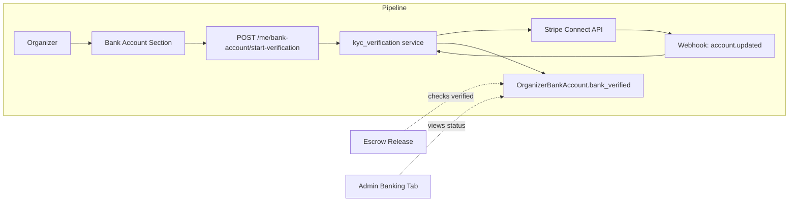

# KYC/AML Verification

## Initiator

- **Who:** Organizer (completes identity verification before receiving payouts); System (blocks payouts to unverified organizers); Admin (views verification status, can manually flag/unflag).
- **When:** Organizer adds bank account → redirected to Stripe Connect onboarding; Escrow release triggers → system checks `bank_verified` before executing payout; Admin → Banking tab → Organizer Payout Status.

## Frontend flow

- **Screen/Widget:** Organizer Profile → Bank Account section (verification status banner, "Complete Verification" button); Admin Banking tab → Organizer Payout Status (verification status per organizer).
- **User action:** Organizer clicks "Complete Verification" → redirected to Stripe Connect hosted onboarding (government ID, proof of address, tax ID). Returns to app with status update. Admin views verification status, cannot bypass verification for payouts.
- **API calls:** POST `/api/v1/me/bank-account/start-verification` (creates Stripe Connect account, returns onboarding URL); GET `/api/v1/me/bank-account/verification-status`; Webhook: `account.updated` from Stripe updates `bank_verified`.

## Backend routing

- **Entry:** `users.py` POST `/me/bank-account/start-verification`, GET `/me/bank-account/verification-status`. Stripe webhook handler for `account.updated`.
- **Handler:** Creates Stripe Connect account link, returns hosted onboarding URL. Webhook updates `OrganizerBankAccount.bank_verified` and `stripe_connect_id`.

## Service layer

- **Module(s):** `app.services.kyc_verification` (new).
- **Main functions:** `create_connect_account(user_id)` (creates Stripe Connect account), `get_onboarding_url(user_id)` (generates hosted onboarding link), `handle_account_updated(stripe_event)` (webhook handler, updates verification status), `is_verified(user_id) -> bool`.

## Models and DB

- **Models:** Extend `OrganizerBankAccount` with:
  - `stripe_connect_id: str` (nullable) -- Stripe Connect account ID
  - `verification_status: str` -- "not_started", "pending", "verified", "restricted"
  - `verification_submitted_at: datetime` (nullable)
  - `verified_at: datetime` (nullable)
- **Tables updated/read:** `organizer_bank_accounts`. No new tables needed -- Stripe stores all identity documents and verification results.

## Dependencies

- **Requires:** [Organizer Bank Accounts](organizer_features_bundle plan, section 4), Stripe Connect API (production only).
- **Triggers / side effects:** Escrow release (all types) checks `bank_verified == true` before executing payout. If not verified, release is approved but payout is queued with status "awaiting_verification". Admin notification: "Payout blocked for {organizer} -- identity not verified."

## Prompt

Implement **KYC/AML Verification** for the Crowd Funding Event app. Backend: Stripe Connect account creation, hosted onboarding URL generation, webhook handler for `account.updated`, verification status on OrganizerBankAccount. Escrow release checks `bank_verified` before payout execution. Frontend: Organizer profile verification banner with "Complete Verification" button, Admin Banking tab shows verification status per organizer. In mock mode, auto-verify all organizers (bypass Stripe Connect).

## Flow diagram

## Vulnerabilities

- In mock mode, auto-verification skips real identity checks. Ensure mock mode banner is visible so admin knows verification is simulated.
- Stripe Connect onboarding link expires after a few hours. If organizer doesn't complete in time, they must request a new link.
- Webhook signature verification is critical -- always validate `stripe-signature` header to prevent spoofed verification updates.

## Improvements

- Add verification tier system: basic (government ID only) for small events, enhanced (business registration + EIN) for events over a revenue threshold.
- Auto-escalate to enhanced verification when an organizer's cumulative payouts exceed a configurable threshold (e.g., $10,000).
- Store verification rejection reasons from Stripe to show organizer what documents need correction.

## Feedback

- KYC/AML is legally required before transferring real money to organizers. Stripe Connect handles the heavy lifting (document collection, identity verification, regulatory reporting). Your system only needs to: create Connect accounts, generate onboarding links, handle webhooks, and gate payouts on verification status. In mock mode, all organizers are auto-verified to enable end-to-end testing without Stripe.
