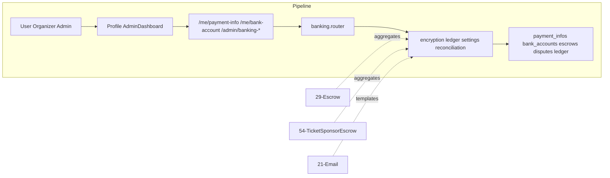

# Banking & Financial Management

## Initiator

- **Who:** User (payment info); Organizer (bank account); Admin (banking overview, disputes, reconciliation, payouts, email templates, mock controls, platform account, transactions).
- **When:** User adds/views payment method; Organizer adds/views bank account for payouts; Admin opens Banking tab in dashboard; payment completes (status polling); dispute opened/resolved; reconciliation run.

## Frontend flow

- **Screen/Widget:** Profile → Payment Info (card details); Organizer Profile → Bank Account (encrypted fields, payout schedule); Admin Dashboard → Banking tab (overview KPIs, escrow aggregates, commission breakdown, payout status, disputes, reconciliation history, transactions, email templates, mock controls).
- **User action:** User saves card details; Organizer saves bank account (bank name, account number, routing, SWIFT, payout schedule/day/min); Admin views banking overview, configures platform holding account, manages disputes (create, resolve, submit evidence, accept loss), runs reconciliation, views/searches transactions, edits/resets/test-sends email templates, clears mock data, settles pending, simulates disputes.
- **API calls:** GET/PUT `/me/payment-info`; GET/PUT `/me/bank-account`; GET `/payments/{transaction_id}/status`; GET `/admin/banking-overview`; GET/PUT `/admin/platform-account`; GET/PUT/POST `/admin/email-templates/*`; GET `/admin/mock-overview`; POST `/admin/mock/clear|settle-all|fail-next|reset-defaults|simulate-dispute`; GET/POST `/admin/disputes`, POST `/admin/disputes/{id}/resolve|submit-evidence|accept`; GET `/admin/ledger-health`; GET/POST `/admin/reconciliation`; GET `/admin/payout-status`; POST `/admin/payouts/{id}/force`; GET `/admin/transactions`.

## Backend routing

- **Entry:** `api_router` → `banking.router` (prefix `/banking` or mounted directly).
- **Handler:** `banking.py` contains all endpoints: user payment info CRUD, organizer bank account CRUD (with `encryption.py` for encrypt/decrypt/mask), payment status lookup on `PaymentMockLedger`, admin banking overview (aggregates across `FundEscrow`, `TicketEscrow`, `SponsorEscrow`, commission from `LedgerEntry`, disputes, reconciliation), platform holding account config via `platform_settings`, email template CRUD, mock overview/controls, dispute management, ledger health via `ledger_svc.verify_balance`, reconciliation via `reconciliation.run_reconciliation`, payout status per organizer, transaction ledger with filters.

## Service layer

- **Module(s):** `app.services.encryption` (encrypt, decrypt, mask_value), `app.services.ledger` (get_account_balance, verify_balance), `app.services.platform_settings` (get_bool, get_str, get_int, set_value), `app.services.reconciliation` (run_reconciliation).
- **Main functions:** `enc.encrypt(value)` / `enc.decrypt(value)` / `enc.mask_value(value)` for bank account fields; `ledger_svc.get_account_balance(db, account)` for commission/tax totals; `ledger_svc.verify_balance(db)` for ledger health; `settings_svc.get_bool/get_str/set_value` for platform holding account and mock settings; `reconciliation.run_reconciliation(db)` for on-demand reconciliation.

### Encryption Service

- **Path:** `app.services.encryption`
- **Key functions:** `encrypt(plaintext: str) -> bytes`, `decrypt(ciphertext: bytes) -> str`, `mask_value(value: str, visible: int = 4) -> str`. Key from `BANK_ENCRYPTION_KEY` env (base64-url-safe or derived); auto-generated Fernet key in dev if unset.
- **Integration:** Organizer bank account CRUD encrypts/decrypts bank name, account number, routing, account holder, SWIFT; responses use `mask_value` for display so raw account numbers are never returned.

### Double-Entry Ledger

- **Path:** `app.services.ledger`
- **Key functions:** `record_entries(db, transaction_id, entries)` (list of debit/credit dicts), `record_charge(db, transaction_id, customer_id, total_cents, escrow_account, escrow_cents, commission_cents, stripe_fee_cents, tax_cents, description)`, `get_account_balance(db, account)`, `verify_balance(db)` (returns total debits/credits, balanced flag, per-account balances).
- **Integration:** Payment gateway records charges and transfers; banking overview uses `get_account_balance` for commission/tax totals and `verify_balance` for ledger health; reconciliation uses ledger balances as expected side.

### Reconciliation Service

- **Path:** `app.services.reconciliation`
- **Key functions:** `run_reconciliation(db)` — computes actual balance from `PaymentMockLedger` (when mock enabled) or 0, expected from ledger account sums (escrow_fund, escrow_ticket, escrow_sponsor, platform_commission, tax_collected), delta and status (balanced vs discrepancy); upserts `ReconciliationReport` for run_date.
- **Integration:** Admin triggers from Banking tab; report stored for audit; same run_date overwrites previous run.

## Models and DB

- **Models:** `UserPaymentInfo` (user_id, card_holder_name, card_last_four, card_brand, billing_address, payment_method_token), `OrganizerBankAccount` (user_id, bank_name_encrypted, account_number_encrypted, routing_number_encrypted, account_holder_encrypted, swift_code_encrypted, verified, payout_schedule, payout_day, min_payout_cents), `PaymentMockLedger` (transaction_id, operation, amount_cents, fee_cents, from_account, to_account, description, status, authorization_code, receipt_reference, failure_reason), `Dispute` (stripe_dispute_id, transaction_id, event_id, user_id, amount_cents, fee_cents, reason, status, resolved_at, outcome_notes, evidence_submitted_at), `EmailTemplate` (template_key, subject, body_html, variables, is_active), `EmailMockLog` (to_email, subject, template_key, status), `LedgerEntry` (account, entry_type, amount_cents, description), `ReconciliationReport` (run_date, actual_balance_cents, expected_balance_cents, delta_cents, status).
- **Tables updated/read:** `user_payment_infos`, `organizer_bank_accounts`, `payment_mock_ledger`, `disputes`, `email_templates`, `email_mock_logs`, `ledger_entries`, `reconciliation_reports`, `fund_escrows`, `ticket_escrows`, `sponsor_escrows`, `platform_settings`.

## Dependencies

- **Requires:** [Auth](01-auth-users.md) (user/organizer/admin roles), [Fund Escrow](29-fund-escrow.md) (banking overview aggregates), [Ticket & Sponsor Escrow](54-ticket-sponsor-escrow.md) (banking overview aggregates), [Admin Dashboard](28-admin-dashboard.md) (Banking tab host), [Email](21-email-notifications.md) (email templates, test-send).
- **Triggers / side effects:** Dispute creation freezes all escrows (fund, ticket, sponsor) for that event. Dispute resolution (won) unfreezes escrows. Mock controls affect payment gateway behavior (fail-next, settle-all). Reconciliation creates a report row.

## Prompt

Implement **Banking & Financial Management** for the Crowd Funding Event app. Backend: GET/PUT `/me/payment-info` (all users), GET/PUT `/me/bank-account` (organizer, encrypted), GET `/payments/{id}/status`, admin banking overview (escrow aggregates, commission, disputes, reconciliation), admin platform account config, admin email templates (CRUD, test-send, reset), admin mock controls (overview, clear, settle, fail-next, simulate-dispute, reset-defaults), admin disputes (list, create, resolve, evidence, accept), admin ledger health, admin reconciliation (list, run), admin payout status (per organizer), admin transaction ledger (filtered, paginated). Frontend: Payment info in profile, bank account in organizer profile, Banking tab in admin dashboard with sub-sections. Follow the flow, dependencies, and diagrams in this document.

## Flow diagram

## Vulnerabilities

- Bank account fields are encrypted at rest (`encryption.py`); ensure encryption key is rotated and not hardcoded. Masked values returned to frontend (never raw account numbers).
- Admin-only endpoints must use `require_role(UserRole.admin)`. Organizer bank account must check `require_role(UserRole.organizer)`.
- Dispute creation auto-freezes escrows; ensure unfreeze on "won" restores correct status (holding vs partially_released vs fully_released).
- Mock controls (clear, fail-next, simulate-dispute) must only be available in mock mode or to admin; production should disable or gate these behind `payment_mock_enabled`.
- SQL injection risk in transaction search: `ilike` with user input should be parameterized (SQLAlchemy handles this, but verify).

## Improvements

- ~~Add audit log for admin actions (dispute resolve, escrow freeze, payout force, mock clear).~~ **Resolved:** [Admin Audit Logging](58-admin-audit-logging.md) implements `log_action` and GET `/admin/audit-log`; callers in banking and admin log these actions.
- Payout force endpoint is a stub (`return {"ok": True}`); implement actual payout logic or ARQ job.
- ~~Commission period filtering (7d/30d/90d) is defined in banking overview but only used for the period parameter; implement time-windowed commission/tax queries.~~ **Resolved:** Commission/tax queries are time-windowed per period in banking overview.
- Mock controls (clear, fail-next, simulate-dispute) are gated behind `payment_mock_enabled` (admin mock overview/controls only when mock is enabled or explicitly allowed). **Resolved.**
- Email template versioning: track changes to templates for rollback.

## Feedback

- Banking module centralizes all financial operations in one router, giving admin a single surface for financial oversight. Encryption of bank details and masked responses follow PCI-adjacent best practices for a mock payment system. Dispute-escrow integration (auto-freeze on dispute, unfreeze on resolution) is a strong trust mechanism.
