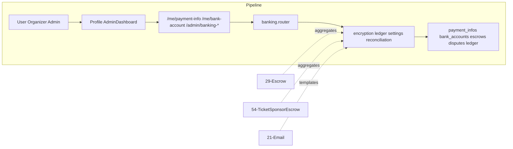

# Banking & Financial Management

## Initiator

- **Who:** User (payment info); Organizer (bank account); Admin (banking overview, disputes, reconciliation, payouts, email templates, mock controls, platform account, transactions).
- **When:** User adds/views payment method; Organizer adds/views bank account for payouts; Admin opens Banking tab in dashboard; payment completes (status polling); dispute opened/resolved; reconciliation run.

## Frontend flow

- **Screen/Widget:** Profile → Payment Info (card details); Organizer Profile → Bank Account (encrypted fields, payout schedule); Admin Dashboard → Banking tab (overview KPIs, escrow aggregates, commission breakdown, payout and transaction summary cards with links to dedicated screens, disputes, reconciliation history, email templates, mock controls); Admin → Payout Status screen (`/admin/payouts`); Admin → Transactions screen (`/admin/transactions`).
- **User action:** User saves card details; Organizer saves bank account (**Canadian banking:** institution number, transit number, account number, account holder, payout schedule/day/min); Admin views banking overview, taps payout or transaction cards to open dedicated Payout Status or Transactions screens, configures platform holding account (institution, transit, account number, account holder), manages disputes (create, resolve, submit evidence, accept loss), runs reconciliation, views/searches/filters transactions on the Transactions screen, views/filters payouts and triggers force payout on the Payouts screen, edits/resets/test-sends email templates, clears mock data, settles pending, simulates disputes.
- **API calls:** GET/PUT `/me/payment-info` (when Stripe enabled returns `mode: "stripe"`, `stripe_customer_id`, `stripe_configured`); GET `/banking/stripe/config` (public: `stripe_enabled`, `stripe_connect_enabled`, `publishable_key`); POST `/banking/payments/create-intent` (501 stub for Stripe Payment Sheet); GET/PUT `/me/bank-account`; GET `/payments/{transaction_id}/status`; GET `/admin/banking-overview` (includes `payout_pending_count`, `payout_pending_total_cents`, `transaction_*` counts); GET/PUT `/admin/platform-account`; GET `/admin/email-templates` (returns all templates, default + DB, each with `is_customized`), PUT/POST `/admin/email-templates/*`, POST `/admin/email-templates/upload-logo` (multipart file); GET `/admin/mock-overview`; POST `/admin/mock/clear|settle-all|fail-next|reset-defaults|simulate-dispute`; GET/POST `/admin/disputes`, POST `/admin/disputes/{id}/resolve|submit-evidence|accept`; GET `/admin/ledger-health`; GET/POST `/admin/reconciliation`; GET `/admin/payout-status`; POST `/admin/payouts/{organizer_id}/force`; GET `/admin/transactions` (paginated, filters: operation, status, date_from, date_to, search).

## Backend routing

- **Entry:** `api_router` → `banking.router` (prefix `/banking` or mounted directly).
- **Handler:** `banking.py` contains all endpoints: user payment info CRUD, organizer bank account CRUD (with `encryption.py` for encrypt/decrypt/mask), payment status lookup on `PaymentMockLedger`, admin banking overview (aggregates, payout/transaction metrics), platform holding account config via `platform_settings`, **email template list** (returns default templates plus DB rows; each item has `is_customized` true if in DB, false if default-only), email template CRUD, **POST `/admin/email-templates/upload-logo`** (multipart file, `validate_upload(db, file, "image")`, save to `static/uploads`, set `platform_settings.email_template_logo_url`, invalidate public config, audit log), mock overview/controls, dispute management, ledger health, reconciliation, payout-status, force-payout (stub), GET `/admin/transactions` (paginated, filterable).

## Service layer

- **Module(s):** `app.services.encryption` (encrypt, decrypt, mask_value), `app.services.ledger` (get_account_balance, verify_balance), `app.services.platform_settings` (get_bool, get_str, get_int, set_value), `app.services.reconciliation` (run_reconciliation).
- **Main functions:** `enc.encrypt(value)` / `enc.decrypt(value)` / `enc.mask_value(value)` for bank account fields; `ledger_svc.get_account_balance(db, account)` for commission/tax totals; `ledger_svc.verify_balance(db)` for ledger health; `settings_svc.get_bool/get_str/set_value` for platform holding account and mock settings; `reconciliation.run_reconciliation(db)` for on-demand reconciliation.

### Encryption Service

- **Path:** `app.services.encryption`
- **Key functions:** `encrypt(plaintext: str) -> bytes`, `decrypt(ciphertext: bytes) -> str`, `mask_value(value: str, visible: int = 4) -> str`. Key from `BANK_ENCRYPTION_KEY` env (base64-url-safe or derived); auto-generated Fernet key in dev if unset.
- **Integration:** Organizer bank account CRUD encrypts/decrypts **institution number**, **transit number**, account number, account holder (Canadian banking fields); responses expose institution/transit and use `mask_value` for account holder; raw full account numbers are never returned (only last four for display).

### Double-Entry Ledger

- **Path:** `app.services.ledger`
- **Key functions:** `record_entries(db, transaction_id, entries)` (list of debit/credit dicts), `record_charge(db, transaction_id, customer_id, total_cents, escrow_account, escrow_cents, commission_cents, stripe_fee_cents, tax_cents, description)`, `get_account_balance(db, account)`, `verify_balance(db)` (returns total debits/credits, balanced flag, per-account balances).
- **Integration:** Payment gateway records charges and transfers; banking overview uses `get_account_balance` for commission/tax totals and `verify_balance` for ledger health; reconciliation uses ledger balances as expected side.

### Reconciliation Service

- **Path:** `app.services.reconciliation`
- **Key functions:** `run_reconciliation(db)` — computes actual balance from `PaymentMockLedger` (when mock enabled) or 0, expected from ledger account sums (escrow_fund, escrow_ticket, escrow_sponsor, platform_commission, tax_collected), delta and status (balanced vs discrepancy); upserts `ReconciliationReport` for run_date.
- **Integration:** Admin triggers from Banking tab; report stored for audit; same run_date overwrites previous run.

## Models and DB

- **Models:** `User` has `stripe_customer_id`, `stripe_connect_account_id` (for Stripe payments and Connect payouts). `UserPaymentInfo` (user_id, card_holder_name, card_last_four, card_brand, billing_address, payment_method_token), `OrganizerBankAccount` (user_id, **institution_number_encrypted**, **transit_number_encrypted**, account_number_encrypted, account_holder_encrypted, verified, verification_status, rejection_reason, payout_schedule, payout_day, min_payout_cents) — **Canadian banking:** no bank_name, routing, or SWIFT; institution (3 digits) and transit (5 digits) replace routing/SWIFT. `PaymentMockLedger` (transaction_id, operation, amount_cents, fee_cents, from_account, to_account, description, status, authorization_code, receipt_reference, failure_reason; **status** and **operation** use DB enums `mockledgerstatus` and `mockledgeroperation`), `Dispute` (stripe_dispute_id, transaction_id, event_id, user_id, amount_cents, fee_cents, reason, status, resolved_at, outcome_notes, evidence_submitted_at; **status** uses DB enum `disputestatus`), `EmailTemplate` (template_key, subject, body_html, variables, is_active), `EmailMockLog` (to_email, subject, template_key, status), `LedgerEntry` (account, entry_type, amount_cents, description), `ReconciliationReport` (run_date, actual_balance_cents, expected_balance_cents, delta_cents, status). Escrow models (`FundEscrow`, `TicketEscrow`, `SponsorEscrow`) use **status** column as `escrow_status` enum.
- **Tables updated/read:** `user_payment_infos`, `organizer_bank_accounts`, `payment_mock_ledger`, `disputes`, `email_templates`, `email_mock_logs`, `ledger_entries`, `reconciliation_reports`, `fund_escrows`, `ticket_escrows`, `sponsor_escrows`, `platform_settings`.
- **Migrations (schema alignment):** `lll_cast_escrow_status_columns` — cast `ticket_escrows.status` and `sponsor_escrows.status` from varchar to `escrow_status` enum; `mmm_create_missing_enum_types` — create `disputestatus`, `mockledgerstatus`, `mockledgeroperation` and cast corresponding columns; **`zz01_canadian_bank_fields`** — rename `organizer_bank_accounts.routing_number_encrypted` → `institution_number_encrypted`, `swift_code_encrypted` → `transit_number_encrypted`, drop `bank_name_encrypted` for Canadian banking compliance.

## Recently implemented (banking & audit management)

- **Banking overview API:** GET `/admin/banking-overview` now returns payout and transaction metrics: `payout_pending_count`, `payout_pending_total_cents`, `transaction_total_count`, `transaction_settled_count`, `transaction_pending_count`, `transaction_failed_count`. Banking tab displays summary cards that link to dedicated screens.
- **Admin Payouts screen:** Route `/admin/payouts`; `AdminPayoutsScreen` lists all organizers with pending payout amount, bank status (missing / configured / verified), payout schedule, search by name/email/id, refresh and force-payout action. Uses GET `/admin/payout-status` and POST `/admin/payouts/{organizer_id}/force`.
- **Admin Transactions screen:** Route `/admin/transactions`; `AdminTransactionsScreen` shows paginated transaction list with search (transaction_id, receipt_reference, description), status filter (all / pending / settled / failed, etc.), and mock-mode indicator. Uses GET `/admin/transactions` with `offset`, `limit`, `search`, `status`, and optional `operation`, `date_from`, `date_to`. The previous inline transaction ledger in the Banking tab was removed in favor of this screen.
- **Router:** `router.dart` registers `GoRoute` for `/admin/payouts` → `AdminPayoutsScreen`, `/admin/transactions` → `AdminTransactionsScreen`, `/admin/escrow-pipeline` → `AdminEscrowPipelineScreen`, `/admin/run-logs` → `AdminRunLogsScreen`.
- **Email template management:** GET `/admin/email-templates` returns all templates (default keys plus any in DB); each item includes `is_customized` (true if row exists in DB, false if only default). Admin Email tab can differentiate default vs customized and offer reset. POST `/admin/email-templates/upload-logo` (multipart): validates file via `upload_validation` (image type), saves to `Backend/static/uploads` as `email_logo_{uuid}.{ext}`, sets platform setting `email_template_logo_url` (public URL), invalidates public config cache, logs `email_logo_upload` to audit.
- **Admin Escrow Pipeline screen:** Route `/admin/escrow-pipeline`; `AdminEscrowPipelineScreen` — full-screen escrow pipeline (fund/ticket/sponsor lists, type filter, search by event title/id/status, event escrow detail). Banking tab links to it via "View pipeline". Uses existing GET escrows by type and event escrow detail APIs.
- **Admin Run Logs screen:** Route `/admin/run-logs`; `AdminRunLogsScreen` — full-screen ARQ worker run log (task name filter, status filter, search). ARQ Control tab links to it. Uses GET `/admin/worker-runs`. See [ARQ Worker Control](65-arq-worker-control.md).
- **Stripe preparation:** Platform settings include `stripe_enabled`, `stripe_publishable_key`, `stripe_secret_key`, `stripe_webhook_secret`, `stripe_connect_enabled`. GET `/banking/stripe/config` exposes Stripe config for frontend; POST `/banking/payments/create-intent` is a 501 stub until Stripe gateway is implemented. When Stripe is enabled, GET `/me/payment-info` returns `mode: "stripe"` and `stripe_customer_id`/`stripe_configured`. Migration `zz03_stripe_fields` adds `stripe_customer_id`, `stripe_connect_account_id` on users and `stripe_payment_intent_id`, `gateway_refund_id` on ticket_sales, fundings, sponsor_payments. Refund worker tasks call `get_gateway(db).refund()` (see [59](59-payment-gateway-mock.md)). Frontend: funding card, ticket tiers section, profile bank section, admin banking and settings tabs, and notification screen adapt to Stripe config (e.g. show Stripe-related messaging or gate flows based on `stripe_enabled`).
- **Canadian banking fields:** Organizer and platform bank accounts use **Canadian** identifiers: **institution number** (3 digits), **transit number** (5 digits), account number (7–12 digits), account holder. API: GET/PUT `/me/bank-account` and GET/PUT `/admin/platform-account` request/response models use `institution_number`, `transit_number` (no bank_name, routing_number, swift_code). Validation: institution exactly 3 digits, transit exactly 5 digits, account 7–12 digits. Migration `zz01_canadian_bank_fields` renames columns and drops `bank_name_encrypted`. Frontend profile bank section and admin banking tab (platform account) updated to collect and display institution/transit; banking overview returns `platform_account_institution` and `platform_account_transit`.

## Dependencies

- **Requires:** [Auth](01-auth-users.md) (user/organizer/admin roles), [Fund Escrow](29-fund-escrow.md) (banking overview aggregates), [Ticket & Sponsor Escrow](54-ticket-sponsor-escrow.md) (banking overview aggregates), [Admin Dashboard](28-admin-dashboard.md) (Banking tab host), [Email](21-email-notifications.md) (email templates, test-send), [Admin Audit Logging](58-admin-audit-logging.md) (payout force and other admin actions logged).
- **Triggers / side effects:** Dispute creation freezes all escrows (fund, ticket, sponsor) for that event. Dispute resolution (won) unfreezes escrows. Mock controls affect payment gateway behavior (fail-next, settle-all). Reconciliation creates a report row. Force payout and bank verify/reject call `audit_svc.log_action`.

## Prompt

Implement **Banking & Financial Management** for the Crowd Funding Event app. Backend: GET/PUT `/me/payment-info` (all users), GET/PUT `/me/bank-account` (organizer, encrypted), GET `/payments/{id}/status`, admin banking overview (escrow aggregates, commission, disputes, reconciliation), admin platform account config, admin email templates (CRUD, test-send, reset), admin mock controls (overview, clear, settle, fail-next, simulate-dispute, reset-defaults), admin disputes (list, create, resolve, evidence, accept), admin ledger health, admin reconciliation (list, run), admin payout status (per organizer), admin transaction ledger (filtered, paginated). Frontend: Payment info in profile, bank account in organizer profile, Banking tab in admin dashboard with sub-sections. Follow the flow, dependencies, and diagrams in this document.

## Flow diagram

## Vulnerabilities

- Bank account fields are encrypted at rest (`encryption.py`); ensure encryption key is rotated and not hardcoded. Masked values returned to frontend (never raw account numbers).
- Admin-only endpoints must use `require_role(UserRole.admin)`. Organizer bank account must check `require_role(UserRole.organizer)`.
- Dispute creation auto-freezes escrows; ensure unfreeze on "won" restores correct status (holding vs partially_released vs fully_released).
- Mock controls (clear, fail-next, simulate-dispute) must only be available in mock mode or to admin; production should disable or gate these behind `payment_mock_enabled`.
- SQL injection risk in transaction search: `ilike` with user input should be parameterized (SQLAlchemy handles this, but verify).

## Improvements

- ~~Add audit log for admin actions (dispute resolve, escrow freeze, payout force, mock clear).~~ **Resolved:** [Admin Audit Logging](58-admin-audit-logging.md) implements `log_action` and GET `/admin/audit-log`; callers in banking and admin log these actions.
- Payout force endpoint is a stub (`return {"ok": True}`); implement actual payout logic or ARQ job.
- ~~Commission period filtering (7d/30d/90d) is defined in banking overview but only used for the period parameter; implement time-windowed commission/tax queries.~~ **Resolved:** Commission/tax queries are time-windowed per period in banking overview.
- Mock controls (clear, fail-next, simulate-dispute) are gated behind `payment_mock_enabled` (admin mock overview/controls only when mock is enabled or explicitly allowed). **Resolved.**
- Email template versioning: track changes to templates for rollback.

## Feedback

- Banking module centralizes all financial operations in one router, giving admin a single surface for financial oversight. Encryption of bank details and masked responses follow PCI-adjacent best practices for a mock payment system. Dispute-escrow integration (auto-freeze on dispute, unfreeze on resolution) is a strong trust mechanism.
