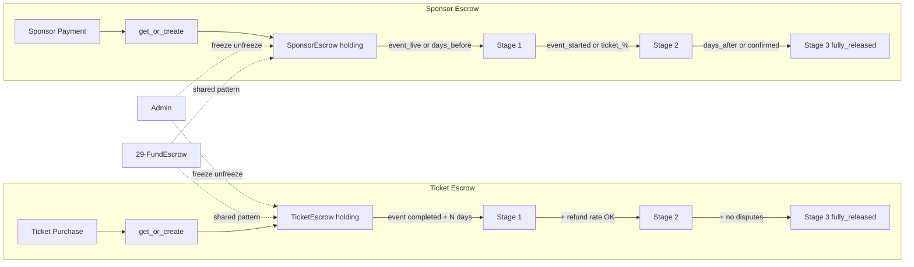

# Ticket & Sponsor Escrow

## Initiator

- **Who:** System (create escrow on first ticket purchase or sponsor payment; auto-release stages by time/event state/conditions); Admin (freeze/unfreeze, manual release, view escrow lists in Banking tab).
- **When:** First ticket purchased for an event creates TicketEscrow; first sponsor payment completed creates SponsorEscrow; stage releases triggered by event completion + grace period (ticket) or event lifecycle milestones (sponsor); Admin Dashboard → Banking/Escrow tab.

## Frontend flow

- **Screen/Widget:** Admin Dashboard → Escrow tab (separate sub-tabs or lists for Fund, Ticket, and Sponsor escrows); Event Detail Funding Card (escrow trust message). Banking Overview shows aggregated escrow totals across all three types.
- **User action:** Admin views ticket/sponsor escrow lists (search, paginate); admin freezes/unfreezes or manually releases stages; customer sees escrow trust message on event detail.
- **API calls:** Admin: listed under banking router — GET `/admin/banking-overview` (aggregated), plus escrow-specific admin endpoints for list, release, freeze, unfreeze (extending the pattern from [Fund Escrow](29-fund-escrow.md)).

## Backend routing

- **Entry:** Escrow services called from `banking.py` (admin overview aggregates), `events/tickets.py` (ticket purchase triggers `get_or_create`), `sponsors/payments.py` (sponsor payment triggers `get_or_create`), and auto-triggers on event status changes.
- **Handler:** `ticket_escrow.py` and `sponsor_escrow.py` service modules; admin escrow management via `banking.py` endpoints.

## Service layer

- **Module(s):** `app.services.ticket_escrow`, `app.services.sponsor_escrow`.
- **Main functions (both modules share the same pattern):**
  - `get_or_create(db, event_id)` — upsert escrow row using `pg_insert ... on_conflict_do_nothing`.
  - `refresh_total(db, event_id)` — recalculate `total_held_cents` from ticket sales or sponsor payments.
  - `release_stage1/2/3(db, event_id, released_by)` — release percentage of held funds; enforces stage order and frozen/refunded guards.
  - `freeze(db, event_id)` / `unfreeze(db, event_id)` — set status to frozen or restore to correct status based on released stages.
  - `list_all(db, offset, limit, search)` — paginated list with event title and organizer info via JOIN.
  - `check_and_release_stage1/2/3(db, event_id)` — auto-trigger functions that check conditions before calling release.
- **Ticket Escrow `_calc_total`:** `SUM(amount_paid_cents - commission_cents)` from `TicketSale` where status = purchased.
- **Sponsor Escrow `_calc_total`:** `SUM(net_to_organizer_cents)` from `SponsorPayment` via `SponsorBid` → `SponsorshipCategory` where status = completed.

## Models and DB

- **Models:** `TicketEscrow` (event_id, total_held_cents, status, stage1/2/3_released_cents, stage1/2/3_released_at), `SponsorEscrow` (same schema). Both use `EscrowStatus` enum (holding, partially_released, fully_released, frozen, refunded). Defined in `app.models.escrow` alongside `FundEscrow`.
- **Tables updated/read:** `ticket_escrows`, `sponsor_escrows`, `ticket_sales` (for ticket total calc), `sponsor_payments` + `sponsor_bids` + `sponsorship_categories` (for sponsor total calc), `events` (for event status/timing checks), `disputes` (for stage 3 no-dispute check on ticket escrow).

## Dependencies

- **Requires:** [Fund Escrow](29-fund-escrow.md) (shared `EscrowStatus` enum and escrow model pattern), [Tickets](19-tickets.md) (ticket sale amounts for TicketEscrow total), [Sponsorship](37-sponsorship-prerequisites.md) (sponsor payment amounts for SponsorEscrow total), [Event Lifecycle](04-event-lifecycle-state-machine.md) (event status for auto-triggers), [Backend Scaling](44-backend-scaling-infra.md) (platform settings for configurable thresholds).
- **Triggers / side effects:** Auto-release enqueues ARQ job `process_escrow_release` with escrow type and stage. Dispute creation in `banking.py` freezes all three escrow types for the event. Dispute resolution (won) unfreezes them.

## Prompt

Implement **Ticket & Sponsor Escrow** for the Crowd Funding Event app. Backend: `ticket_escrow.py` — get_or_create on first ticket purchase, refresh_total from ticket sales, 3-stage release (Stage 1: N days after event completed, Stage 2: + refund rate below threshold, Stage 3: + no open disputes), freeze/unfreeze, list_all, auto-trigger checks. `sponsor_escrow.py` — get_or_create on first sponsor payment, refresh_total from sponsor payments, 3-stage release (Stage 1: event_live or days_before_event, Stage 2: event_started or ticket %, Stage 3: days_after_event or sponsor_confirmed), freeze/unfreeze, list_all, auto-trigger checks. Models: `TicketEscrow`, `SponsorEscrow` in escrow.py (same schema as FundEscrow). All stage percents, days, and trigger modes configurable via platform_settings. Follow the flow, dependencies, and diagrams in this document.

## Flow diagram

## Vulnerabilities

- Stage release order is enforced (1 → 2 → 3); ensure `release_stage2` rejects if `stage1_released_at` is null, and `release_stage3` rejects if `stage2_released_at` is null.
- `_reject_if_blocked` guards against releasing from frozen or refunded escrows; ensure freeze during an in-progress release is handled (transaction isolation).
- `on_conflict_do_nothing` in `get_or_create` handles concurrent creation; verify the subsequent SELECT always returns the row.
- Sponsor escrow `_calc_total` joins through `SponsorBid` → `SponsorshipCategory`; ensure the join path is correct when a category has multiple bids or a bid has multiple payments.
- Auto-trigger `check_and_release_stage2` for ticket escrow uses integer division for refund rate (`(refunds * 100) // total`); edge cases near threshold should be tested.

## Improvements

- ~~Unify the three escrow services (fund, ticket, sponsor) into a generic base class or shared utility to reduce code duplication (all three share identical `get_or_create`, `freeze`, `unfreeze`, `list_all` patterns).~~ **Resolved:** [Fund Escrow](29-fund-escrow.md) documents Shared Escrow Base (`app.services.escrow_base`); fund, ticket, and sponsor escrow use `generic_freeze`, `generic_unfreeze`, `generic_release_stage`, `generic_list_all`.
- ~~Add `released_by` field tracking (system vs admin) to the escrow model for audit.~~ **Resolved:** `released_by` is supported in release_stage flows and stored in EscrowRelease / stage metadata where applicable.
- Consider a cron/scheduled job that periodically runs all `check_and_release_*` functions across events, rather than relying on event-fetch triggers.
- Add email notifications when escrow stages are released (organizer should know funds are available).

## Feedback

- The three-escrow pattern (fund, ticket, sponsor) provides granular financial control: pledge funds, ticket revenue, and sponsor payments each have independent release schedules and freeze controls. This prevents a dispute in one revenue stream from blocking all payouts. The configurable stage triggers via platform_settings give admin flexibility without code changes.
