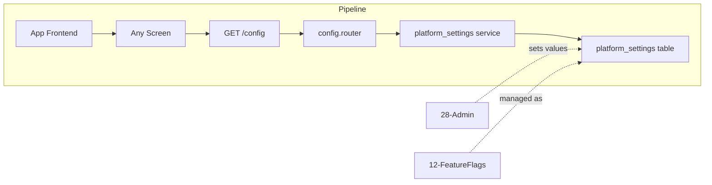

# Public Configuration Endpoint

## Initiator

- **Who:** App (frontend, on startup or when config is needed); any client (no auth required).
- **When:** App launch; before rendering feature-gated UI (milestones, schedule, sponsors, community rules); before ticket purchase (max per purchase limit).

## Frontend flow

- **Screen/Widget:** No dedicated screen. Config values consumed by: Create Event wizard (show/hide milestone, schedule, sponsor steps based on feature flags); Event Detail (show/hide schedule, sponsors, community rules sections); Ticket Purchase flow (enforce max tickets per purchase); any screen that conditionally renders based on platform settings.
- **User action:** None (automatic). Frontend fetches config on load and uses values to conditionally render UI and enforce limits.
- **API calls:** GET `/config` (no auth header required).

## Backend routing

- **Entry:** `api_router` → `config.router` (prefix `/config`).
- **Handler:** `config.py` — single endpoint `get_public_config` that reads a curated list of platform settings and returns them as a flat JSON object.

## Service layer

- **Module(s):** `app.services.platform_settings` (get_int, get_bool).
- **Main functions:** Reads the following keys:
  - Integer keys: `max_tickets_per_purchase`.
  - Boolean keys: `max_tickets_frontend_enabled`, `feature_milestones_enabled`, `feature_schedule_enabled`, `feature_sponsors_enabled`, `feature_community_rules_enabled`, **`offline_ticket_auto_download_enabled`** (used by TicketScannerScreen for auto-download when open; see [71-offline-sync-local-cache](71-offline-sync-local-cache.md)).
  - Returns a dict with key-value pairs for each setting.

### Frontend ConfigProvider

- **Path:** `FrontEnd/lib/providers/config_provider.dart`
- **Key functions:** `ConfigProvider(ApiService)` — holds `maxTicketsPerPurchase`, `maxTicketsFrontendEnabled`, `featureMilestonesEnabled`, `featureScheduleEnabled`, `featureSponsorsEnabled`, `featureCommunityRulesEnabled`, **`offlineTicketAutoDownloadEnabled`**; `fetchConfig()` calls `_api.getPublicConfig()` and updates these from the response (with defaults if keys missing); `loaded` getter; `notifyListeners()` after fetch so UI can react. Graceful degradation on fetch failure (keeps defaults).
- **Integration:** App startup (e.g. in main or root widget) calls `configProvider.fetchConfig()`; screens read the provider to conditionally show milestones, schedule, sponsors, community rules and to enforce max tickets per purchase.

## Models and DB

- **Models:** `PlatformSetting` (key, value).
- **Tables updated/read:** `platform_settings` (read-only). No writes from this endpoint.

## Dependencies

- **Requires:** [Feature Flags](12-feature-flags.md) (the settings this endpoint exposes are managed as feature flags), [Admin Dashboard](28-admin-dashboard.md) (admin sets these values via Settings tab).
- **Triggers / side effects:** None. Read-only endpoint.

## Prompt

Implement **Public Configuration Endpoint** for the Crowd Funding Event app. Backend: GET `/config` (no auth) that returns a curated subset of platform settings — `max_tickets_per_purchase`, `max_tickets_frontend_enabled`, `feature_milestones_enabled`, `feature_schedule_enabled`, `feature_sponsors_enabled`, `feature_community_rules_enabled` — using `platform_settings` service. No frontend screen; values consumed by existing screens for conditional rendering and limit enforcement. Follow the flow, dependencies, and diagrams in this document.

## Flow diagram

## Vulnerabilities

- Endpoint is unauthenticated; ensure only non-sensitive settings are exposed. The curated key lists (`_PUBLIC_INT_KEYS`, `_PUBLIC_BOOL_KEYS`) act as an allowlist — never return all platform settings.
- If new sensitive settings are added to platform_settings, they must not be added to the public key lists without review.
- Rate limiting is per IP (see [61-configurable-rate-limits.md](61-configurable-rate-limits.md)); under heavy load, caching (short TTL) via [Redis Caching](49-redis-caching.md) reduces DB load.

## Improvements

- ~~Cache the config response in Redis with a short TTL (60-120s) to avoid hitting the DB on every app load. Invalidate on admin settings change.~~ **Resolved:** Config endpoint uses Redis cache with TTL 120s; `invalidate_public_config()` clears cache on admin settings change.
- Add an ETag or `Last-Modified` header so the frontend can skip re-fetching if config hasn't changed.
- Consider adding more public keys as features grow (e.g. `feature_ratings_enabled`, `feature_bookmarks_enabled`) to give admin full control over feature visibility without frontend deploys.
- ~~Frontend: fetch config once on app startup, store in a provider, and make it available to all screens.~~ **Resolved:** `ConfigProvider` (see Frontend ConfigProvider subsection) fetches on startup and exposes values to all screens.
- ~~No rate limiting on this endpoint currently.~~ **Resolved:** GET `/config` is rate-limited (default 60/minute **per IP**) and the limit is configurable; see [Configurable API Rate Limits](61-configurable-rate-limits.md).

## Feedback

- Simple but important endpoint: decouples feature visibility from frontend code. Admin can enable/disable milestones, schedule, sponsors, and community rules from the Settings tab, and the frontend reacts without a new build. The allowlist pattern (`_PUBLIC_INT_KEYS`, `_PUBLIC_BOOL_KEYS`) ensures only safe values are exposed publicly.
