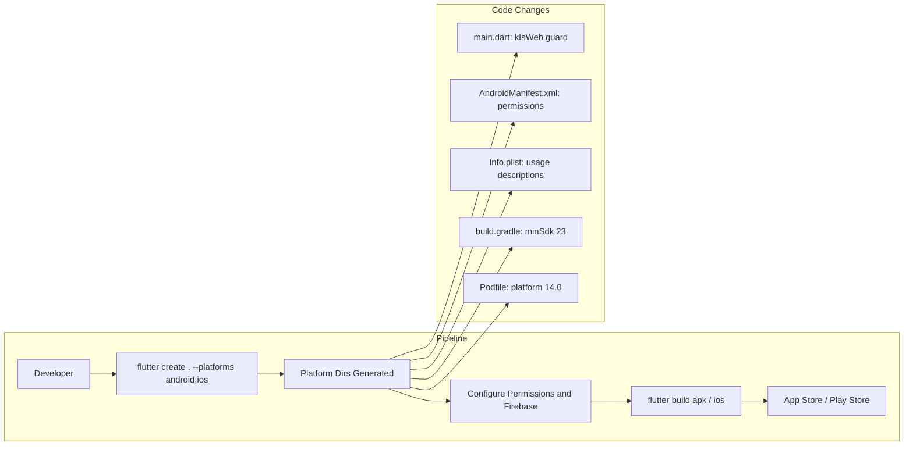

# Mobile Platform (iOS & Android)

## Initiator

- **Who:** Developer/Ops (platform setup, build, deploy); User (installs and uses the mobile app).
- **When:** Initial platform scaffold; Firebase mobile configuration; each release build (APK/AAB for Android, IPA for iOS); app store submission.

## Frontend flow

- **Screen/Widget:** No new screens. All existing Flutter screens, widgets, providers, and services run on iOS and Android without modification. Key code change: guard `usePathUrlStrategy()` in `lib/main.dart` with `kIsWeb` (web-only API).
- **User action:** User installs the app from Google Play or Apple App Store; all existing flows (auth, events, tickets, funding, admin, sponsor) work identically to web.
- **API calls:** Same as web — all API calls go through `ApiService` using `dio` which works on all platforms. No platform-specific API changes.

## Backend routing

- N/A. No backend changes required. The mobile app talks to the same API server as the web app.

## Service layer

- N/A. No new services. Firebase initialization already uses `FirebaseOptions` from `.env` which works on all platforms. For production mobile builds, use FlutterFire CLI (`flutterfire configure`) to generate `firebase_options.dart` with per-platform config, or manually add `google-services.json` (Android) and `GoogleService-Info.plist` (iOS).

## Models and DB

- N/A. No model or database changes.

## Dependencies

- **Requires:** [Auth](01-auth-users.md) (Firebase Auth — needs mobile Firebase config), [Frontend Screens & UX](31-frontend-screens-ux.md) (all screens must render correctly on mobile viewports).
- **Triggers / side effects:** Mobile-native packages already in `pubspec.yaml` activate on mobile builds: `mobile_scanner` (camera QR scanning), `image_picker` (camera/gallery), `geolocator` (GPS location), `flutter_secure_storage` (Keychain/Keystore), `flutter_map` (touch gestures, pinch zoom).

## Prompt

Set up **Mobile Platform (iOS & Android)** for the Crowd Funding Event Flutter app. Run `flutter create . --platforms android,ios` to generate platform directories. Guard `usePathUrlStrategy()` with `kIsWeb` in `lib/main.dart`. Android: set minSdk to 23 in `build.gradle`, add INTERNET, CAMERA, and LOCATION permissions in `AndroidManifest.xml`. iOS: set minimum deployment target to 14.0 in Podfile, add NSCameraUsageDescription, NSPhotoLibraryUsageDescription, and NSLocationWhenInUseUsageDescription to `Info.plist`. Configure Firebase for mobile via FlutterFire CLI or manual `google-services.json`/`GoogleService-Info.plist`. No backend changes; no new Dart code beyond the `kIsWeb` guard. Follow the flow, dependencies, and diagrams in this document.

## Flow diagram

## Vulnerabilities

- **iOS builds require macOS + Xcode.** The current development environment is WSL2 (Linux); iOS builds cannot be done locally. Use a Mac, cloud Mac (Codemagic, GitHub Actions macOS runner), or CI/CD pipeline for iOS.
- `.env` is bundled as a Flutter asset; ensure it does not contain production secrets in release builds. Use platform-specific config or environment injection for production API keys.
- `flutter_secure_storage` uses Android Keystore (minSdk 23+) and iOS Keychain; behavior differs from web `localStorage`. Ensure auth token storage works correctly on both platforms.
- Deep links and URL-based routing (`go_router` with path strategy) may need platform-specific configuration (Android App Links, iOS Universal Links) for external link handling.

## Improvements

- Set up CI/CD (Codemagic or GitHub Actions) for automated Android and iOS builds on push to main.
- Add platform-specific UI adaptations: `CupertinoAlertDialog` on iOS vs `AlertDialog` on Android using `Platform.isIOS` checks for native feel.
- Add push notifications via Firebase Cloud Messaging (FCM) to replace or supplement the current polling-based `NotificationProvider`.
- Add app icons and splash screens using `flutter_launcher_icons` and `flutter_native_splash` packages.
- Consider adaptive layouts: the current UI is designed for web/tablet; add responsive breakpoints for small phone screens (< 360dp width).

## Feedback

- The Flutter codebase is already mobile-ready: all packages in `pubspec.yaml` support iOS and Android, state management (`provider`), routing (`go_router`), networking (`dio`), and storage (`flutter_secure_storage`, `shared_preferences`) are cross-platform. The only code change needed is a single `kIsWeb` guard in `main.dart`. The remaining work is platform scaffolding (directories, permissions, Firebase config) and build/deploy infrastructure.
