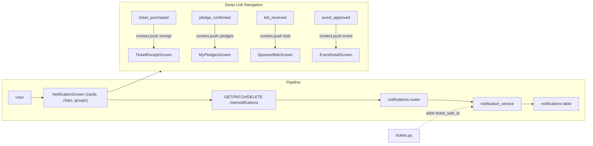

# Clickable Notifications Redesign

## Initiator

- **Who:** User (view, tap to deep-link, swipe to dismiss/delete); System (enriched notification data).
- **When:** User opens Notification screen; taps a notification to navigate to the relevant detail screen; swipes to mark-read or delete.

## Frontend flow

- **Screen/Widget:** `NotificationScreen` redesigned with category filter chips (All / Events / Tickets / Funding / Sponsors), date-grouped sections (Today, Yesterday, This Week, Earlier), modern card-based notification items with type-aware icons, swipe-to-dismiss (`Dismissible`), and an empty state illustration.
- **User action:** Filter by category chip; tap notification card to deep-link via GoRouter (`context.push`) to the correct screen (ticket receipt, pledge list, sponsor bids, event detail, etc.); swipe right to mark read (green); swipe left to delete (red with undo snackbar); pull-to-refresh.
- **API calls:** Existing `GET /me/notifications`, `GET /me/notifications/unread-count`, `PATCH /me/notifications/{id}/read`, `PATCH /me/notifications/read-all`; new `DELETE /me/notifications/{id}`.

## Backend routing

- **Entry:** `api_router` → `notifications.router` prefix `/me`.
- **Handler:** `notifications.py` → existing GET list, GET unread-count, PATCH read, PATCH read-all; new DELETE `/{notification_id}` (only own notifications).

## Service layer

- **Module(s):** `app.services.notification_service`.
- **Main functions:** Existing `create_notification`, `list_notifications`, `unread_count`, `mark_read`, `mark_all_read`; new `delete_notification(db, notification_id, user_id)` — deletes only if owned by user.
- **Notification data enrichment:** `ticket_sale_id` added to `data` JSON in 5 ticket notification calls in `events/tickets.py` (`ticket_purchased`, `ticket_waitlist_approved`, `ticket_waitlist_rejected`, `refund_issued` approved, `refund_issued` rejected) to enable direct deep-link navigation to ticket receipts.

## Models and DB

- **Models:** `Notification` (existing — user_id, type, title, message, data JSON, is_read, created_at). No schema changes.
- **Tables updated/read:** `notifications` (new DELETE operation).

## Dependencies

- **Requires:** [In-App Notifications](34-in-app-notifications.md), [Auth](01-auth-users.md), [Tickets](19-tickets.md) (for `ticket_sale_id` enrichment), GoRouter ([Frontend Screens](31-frontend-screens-ux.md)).
- **Triggers / side effects:** Delete removes row from `notifications` table; swipe-right marks `is_read = true`.

## Prompt

Implement **Clickable Notifications Redesign** for the Crowd Funding Event app. Backend: add `DELETE /me/notifications/{id}` endpoint (user-scoped); enrich notification `data` with `ticket_sale_id` in 5 ticket notification calls. Frontend: replace plain `ListTile` with modern card UI — category filter chips, date-grouped sections, type-aware deep-link navigation via GoRouter (`context.push`), swipe-to-dismiss (mark read / delete with undo), empty state, and entrance animations. Use `AppTheme` context-aware helpers for dark/light mode. Follow the flow, dependencies, and diagrams in this document.

## Flow diagram

## Vulnerabilities

- DELETE endpoint must validate `notification.user_id == current_user.id` to prevent cross-user deletion.
- Optimistic delete on frontend should roll back on API failure and show error toast.
- Deep-link navigation must handle missing `data` fields gracefully (fall back to event detail or no-op).

## Improvements

- Add push notification support (FCM) for real-time delivery instead of 30s polling.
- Add mark-unread endpoint for full swipe-right toggle behavior.
- Batch delete support (`DELETE /me/notifications` with body `{"ids": [...]}`) for bulk cleanup.
- Sound/vibration on new notification arrival (mobile only).
- Notification grouping by event (collapse multiple updates for the same event into one expandable card).

## Feedback

- Builds on top of [34-in-app-notifications](34-in-app-notifications.md) without breaking existing API contracts. The only new endpoint is DELETE; all other endpoints remain backward-compatible. Data enrichment is additive (extra keys in existing JSON field). Frontend is a full redesign of the notification screen UI with no impact on other screens.
