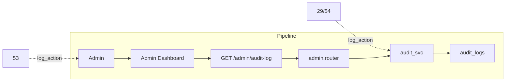

# Admin Audit Logging

## Initiator

- **Who:** Admin (all actions are recorded); System (no direct initiator for the log itself).
- **When:** Every admin action that modifies escrow (freeze/unfreeze/release), disputes (create/resolve), settings, mock controls (clear, settle, fail-next, simulate-dispute), or payouts (force) is logged. Admin views the audit log from the Admin Dashboard.

## Frontend flow

- **Screen/Widget:** Admin Dashboard → Audit Log (or dedicated Audit tab).
- **User action:** Admin opens audit log, optionally filters by action, target_type, or admin_id; paginates through entries.
- **API calls:** GET `/admin/audit-log` with query params `offset`, `limit`, `action`, `target_type`, `admin_id`.

## Backend routing

- **Entry:** `api_router` → `admin.router` (prefix `/admin`).
- **Handler:** `admin.py` — GET `/audit-log` (admin-only). Delegates to `audit_svc.list_audit_logs()` and returns paginated items with `total`, `offset`, `limit`.

## Service layer

- **Module(s):** `app.services.audit`, `app.models.audit_log`.
- **Main functions:**
  - `log_action(db, *, admin_id, action, target_type, target_id=None, details=None)` — appends an immutable audit entry; called from escrow freeze/unfreeze/release, dispute create/resolve, settings update, mock clear/settle/fail-next/simulate-dispute, payout force.
  - `list_audit_logs(db, *, offset=0, limit=50, action=None, target_type=None, admin_id=None)` — returns `(list[AuditLog], total)` with optional filters, ordered by `created_at` descending.

## Models and DB

- **Models:** `AuditLog` in `app.models.audit_log` — `id`, `admin_id` (FK users.id), `action` (string, indexed), `target_type` (string), `target_id` (string, nullable), `details` (JSONB, nullable), `created_at` (timestamp with timezone, indexed).
- **Tables updated/read:** `audit_logs`. Writes only via `log_action`; no updates or deletes. Reads via `list_audit_logs`.

## Dependencies

- **Requires:** [Auth](01-auth-users.md) (admin role for viewing and for all logged actions), [Admin Dashboard](28-admin-dashboard.md) (host for Audit tab). Callers of `log_action`: [Fund Escrow](29-fund-escrow.md), [Ticket & Sponsor Escrow](54-ticket-sponsor-escrow.md), [Banking](53-banking-financial-management.md) (disputes, mock controls, payout force, settings).

## Prompt

Implement **Admin Audit Logging** for the Crowd Funding Event app. Backend: `AuditLog` model (admin_id, action, target_type, target_id, details, created_at); `audit.log_action()` called from escrow freeze/unfreeze/release, dispute create/resolve, settings update, mock clear/settle/fail-next/simulate-dispute, payout force; GET `/admin/audit-log` with pagination and filters (action, target_type, admin_id). Frontend: Admin Dashboard Audit tab that lists and filters audit entries. Follow the flow, dependencies, and diagrams in this document.

## Flow diagram

## Vulnerabilities

- Audit log is append-only; ensure no endpoint allows update or delete of audit entries. Admin_id must be the authenticated admin for every `log_action` call.
- Pagination and filters must be validated (offset ≥ 0, limit within bounds) to avoid abuse.

## Improvements

- Optional: export audit log (CSV/JSON) for compliance. Retention policy (e.g. archive or purge after N days).

## Feedback

- Centralized audit of admin actions supports compliance and debugging. Immutable log and filters make it easy to trace who did what and when.
