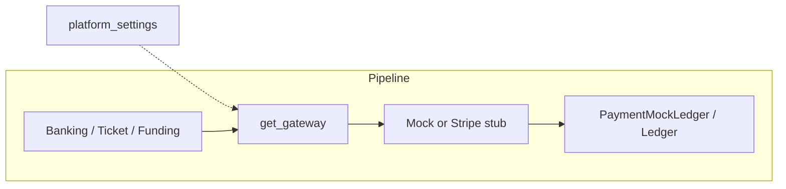

# Payment Gateway (Mock)

## Initiator

- **Who:** System / backend (charge on ticket purchase, pledge, sponsor payment; transfer on escrow release; refund on refund request; hold/release for escrow). No direct user call to the gateway; callers use `get_gateway(db)` to obtain the implementation.
- **When:** Ticket purchase, pledge payment, sponsor payment (charge); payout to organizer (transfer); refund flow (refund); escrow hold/release (hold, release_hold). Gateway choice is determined by platform settings: `stripe_enabled` (if true, Stripe is selected but raises until implemented) else Mock.

## Frontend flow

- **Screen/Widget:** None. Gateway is backend-only. Frontend sees payment status via transaction/ledger endpoints.
- **User action:** N/A.
- **API calls:** None to this module directly; payment flows call services that use the gateway.

## Backend routing

- **Entry:** No dedicated router. Used by banking, ticket, funding, and sponsor payment flows.
- **Handler:** Callers import `get_gateway` from `app.services.payment_gateway` and invoke `charge`, `transfer`, `refund`, `hold`, or `release_hold` on the returned instance.

## Service layer

- **Module(s):** `app.services.payment_gateway`.
- **Abstract interface:** `PaymentGateway` (ABC) with abstract methods:
  - `charge(db, *, user_id, amount_cents, description, idempotency_key=None, escrow_account="holding_account", commission_cents=0, tax_cents=0)` → `ChargeResult`
  - `transfer(db, *, from_account, to_account, amount_cents, description)` → `TransferResult`
  - `refund(db, *, original_transaction_id, amount_cents, description)` → `RefundResult`
  - `hold(db, *, account, amount_cents, description)` → `HoldResult`
  - `release_hold(db, *, hold_id, to_account, amount_cents)` → `TransferResult`
- **Result data classes:** `ChargeResult`, `TransferResult`, `RefundResult`, `HoldResult` (each with `transaction_id`, `status`, `authorization_code`; charge/transfer/refund have optional `receipt_reference`).
- **Implementations:**
  - `MockPaymentGateway`: configurable latency (platform settings e.g. `mock_charge_latency_min_ms`, `mock_charge_latency_max_ms`), failure rate (`mock_failure_rate_percent`), one-off fail-next (`mock_fail_next_charge`). Idempotency: when `idempotency_key` is provided, returns existing `PaymentMockLedger` result if present. Writes to `PaymentMockLedger` and uses `ledger_svc.record_charge` / `record_entries` for double-entry.
  - `StripePaymentGateway`: abstract base (no methods implemented); subclass and implement for real Stripe. When `stripe_enabled` is true, `get_gateway(db)` raises `RuntimeError` until a concrete Stripe implementation is wired in.
- **Factory:** `get_gateway(db: AsyncSession) -> PaymentGateway` — if `stripe_enabled` is true, raises `RuntimeError` ("Stripe is enabled but not yet implemented"); else returns `MockPaymentGateway()`. Platform settings: `stripe_enabled`, `stripe_publishable_key`, `stripe_secret_key`, `stripe_webhook_secret`, `stripe_connect_enabled` (see [66](66-admin-settings-expansion.md)).

## Models and DB

- **Models:** Uses `PaymentMockLedger`, `LedgerEntry` (via ledger service). No models defined in this module.
- **Tables updated/read:** `payment_mock_ledger`, `ledger_entries` (via ledger), `platform_settings` (for stripe_enabled, Stripe keys, mock latency, failure rate, fee config).

## Dependencies

- **Requires:** [Banking & Financial Management](53-banking-financial-management.md) (platform settings, ledger), [Ticket & Sponsor Escrow](54-ticket-sponsor-escrow.md) and [Fund Escrow](29-fund-escrow.md) (hold/release flows). Critical for future [KYC/AML](52-kyc-aml-verification.md) and real Stripe integration.

## Prompt

Implement **Payment Gateway (Mock)** for the Crowd Funding Event app. Backend: abstract `PaymentGateway` with charge, transfer, refund, hold, release_hold; result dataclasses; `MockPaymentGateway` with configurable latency and failure rates and idempotency; `StripePaymentGateway` stub; `get_gateway(db)` factory based on `payment_mock_enabled`. No frontend. Follow the flow, dependencies, and diagrams in this document.

## Flow diagram

## Vulnerabilities

- When Stripe is enabled but not implemented, `get_gateway` raises; admins are notified via [34](34-in-app-notifications.md) (settings_warning). Mock remains default until Stripe (or another gateway) is fully implemented. Ensure admin controls for mock (clear, fail-next, etc.) are gated per [53](53-banking-financial-management.md).
- Idempotency keys must be unique per logical operation to avoid double charges.

## Improvements

- Implement `StripePaymentGateway` with real Stripe API for charges, transfers, refunds. Webhook handling is in [60-stripe-webhooks](60-stripe-webhooks.md).

## Feedback

- Clean abstraction allows swapping mock for Stripe without changing callers. Mock is suitable for development and testing; configurable latency and failure help test UI and retry logic.
