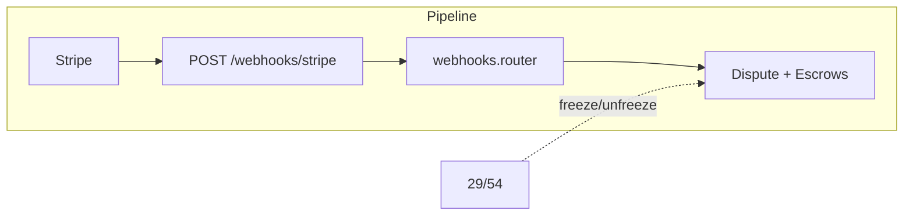

# Stripe Webhooks

## Initiator

- **Who:** Stripe (sends webhook events); no user action. Backend receives POST from Stripe.
- **When:** A charge dispute is created or closed in Stripe; Stripe sends `charge.dispute.created` or `charge.dispute.closed` to the configured webhook URL.

## Frontend flow

- **Screen/Widget:** None. Webhooks are server-to-server.
- **User action:** N/A.
- **API calls:** None from frontend. Stripe calls POST `/webhooks/stripe` (or mounted path).

## Backend routing

- **Entry:** Webhook router mounted on API (e.g. prefix so that POST `/webhooks/stripe` is the endpoint).
- **Handler:** `app.api.v1.webhooks` — `stripe_webhook(request, db, stripe_signature)`. Reads raw body; in non-mock mode verifies `Stripe-Signature` header using `stripe.Webhook.construct_event` and `stripe_webhook_secret` from platform settings. In mock mode, skips signature verification and parses body as JSON.

## Service layer

- **Module(s):** Logic in `webhooks.py` (no separate service). Helpers: `_freeze_escrows(db, event_id)` — sets status to frozen for `FundEscrow`, `TicketEscrow`, `SponsorEscrow` for that event when not already frozen or fully_released; `_unfreeze_escrows(db, event_id)` — for each escrow that is frozen, restores status to `fully_released` if stage3 released, else `partially_released` if stage1 released, else `holding`.

## Event handling

- **charge.dispute.created:** Creates `Dispute` from event data (stripe_dispute_id, charge id, amount, reason, metadata event_id/user_id). If `event_id` present, calls `_freeze_escrows(db, event_id)`. Duplicate stripe_dispute_id returns `{"ok": true, "message": "duplicate"}`.
- **charge.dispute.closed:** Looks up `Dispute` by stripe_dispute_id; sets `resolved_at`. If status is "won", sets dispute status to won and calls `_unfreeze_escrows(db, event_id)`; else sets status to lost. Returns `{"ok": true}`.

## Models and DB

- **Models:** `Dispute` (stripe_dispute_id, transaction_id, event_id, user_id, amount_cents, reason, status, resolved_at, etc.). Escrow models: `FundEscrow`, `TicketEscrow`, `SponsorEscrow` (status and stage fields updated).
- **Tables updated/read:** `disputes` (insert/update), `fund_escrows`, `ticket_escrows`, `sponsor_escrows` (status updates).

## Dependencies

- **Requires:** [Banking & Financial Management](53-banking-financial-management.md) (disputes, platform settings for webhook secret), [Fund Escrow](29-fund-escrow.md), [Ticket & Sponsor Escrow](54-ticket-sponsor-escrow.md) (all three escrow types are auto-frozen on dispute and auto-unfrozen on resolution).

## Prompt

Implement **Stripe Webhooks** for the Crowd Funding Event app. Backend: POST `/webhooks/stripe` that verifies Stripe signature (when not mock) using `stripe_webhook_secret`; on `charge.dispute.created` create Dispute and freeze all three escrow types for the event; on `charge.dispute.closed` resolve dispute and unfreeze escrows when status is "won" (restore status from stage flags). No frontend. Follow the flow, dependencies, and diagrams in this document.

## Flow diagram

## Vulnerabilities

- Always verify Stripe signature in production; do not skip verification when `stripe_webhook_secret` is set. Use raw body for verification (FastAPI must not parse body before verification).
- Webhook endpoint should not require auth (Stripe does not send bearer tokens). Rate limiting may be applied per-IP if needed.

## Improvements

- Handle additional event types (e.g. charge.succeeded, payment_intent) if needed for reconciliation or idempotency.

## Feedback

- Dispute-driven escrow freeze/unfreeze keeps funds protected when a dispute is opened and restores correct state when the dispute is won, without manual admin steps.
