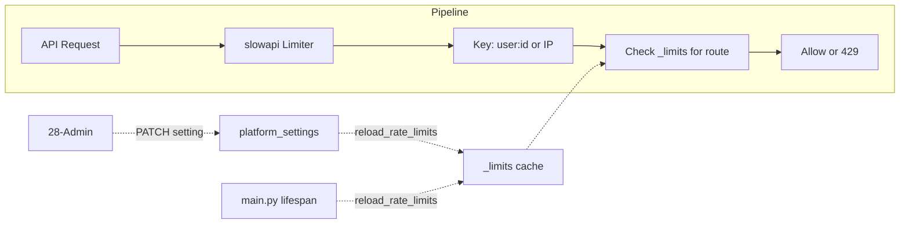

# Configurable API Rate Limits

## Initiator

- **Who:** Admin (via Settings tab); system (every API request is evaluated against the current limits).
- **When:** Admin edits any `rate_limit_*` setting; on every API request the limiter checks the current limit for that endpoint category.

## Frontend flow

- **Screen/Widget:** Admin Dashboard → Settings tab → **API Rate Limits** card (collapsible). Lists 13 rate limit settings with descriptions; each value editable via dialog.
- **User action:** Admin expands "API Rate Limits", clicks edit on a key, enters a value in format `N/second`, `N/minute`, `N/hour`, or `N/day`, saves. Validation: value must match regex `^\d+/(second|minute|hour|day)$`.
- **API calls:** PATCH `/admin/settings/{key}` with body `{ "value": "60/minute" }`. On save, backend reloads in-memory rate limits so new values apply immediately without restart.

## Backend routing

- **Entry:** `app.rate_limit` — `limiter` (slowapi), `dynamic_limit(endpoint_key, fallback)`, `reload_rate_limits(db)`. Applied via `@limiter.limit(dynamic_limit("auth_verify", "10/minute"))` (or string) on each route.
- **Handler:** Rate limit **key** (who is limited): **per person** — authenticated requests use `user:{user.id}`; unauthenticated use client IP (`get_remote_address(request)`). So each user or IP has their own independent bucket (e.g. 15/minute per user for ticket purchase, not 15/minute total across all users).

## Service layer

- **Module(s):** `app.rate_limit` (limiter, dynamic_limit, reload_rate_limits, _limits cache), `app.services.platform_settings` (get_str for rate_limit_* keys).
- **Main functions:**
  - `_key_func(request)` → `user:{id}` or IP; used by slowapi to bucket requests.
  - `dynamic_limit(endpoint_key, fallback)` → callable that returns the current limit string from in-memory `_limits` (e.g. `"10/minute"`). Fallback used if key missing.
  - `reload_rate_limits(db)` → async; reads all `rate_limit_*` settings from DB, validates format (`^\d+/(second|minute|hour|day)$`), updates `_limits`; invalid values are skipped (existing/default stays).
- **Startup:** `main.py` lifespan calls `reload_rate_limits(db)` after loading cache_enabled so limits are loaded from DB on boot.
- **Admin change:** When PATCH `/admin/settings/{key}` is called and `key.startswith("rate_limit_")`, admin router calls `reload_rate_limits(db)` after updating the setting so new limits apply immediately.

## Models and DB

- **Models:** None dedicated. Uses `PlatformSetting` (key, value) for `rate_limit_*` keys.
- **Tables updated/read:** `platform_settings` (read/write by admin). Rate limit module reads via platform_settings service and caches in process memory.

## Configurable keys (13)

| Setting key | Default | Used for |
|-------------|---------|----------|
| `rate_limit_global_default` | 120/minute | Any route without a specific decorator |
| `rate_limit_auth_verify` | 10/minute | POST /auth/verify |
| `rate_limit_public_config` | 60/minute | GET /config |
| `rate_limit_event_register` | 20/minute | POST /events/{id}/register |
| `rate_limit_ticket_purchase` | 15/minute | POST /events/{id}/purchase-ticket |
| `rate_limit_pledge` | 20/minute | POST /events/{id}/pledge |
| `rate_limit_file_upload` | 10/minute | Event image upload, schedule image upload, prerequisite document uploads |
| `rate_limit_payment_action` | 10/minute | PUT payment-info, PUT bank-account, pay/refund bid, ticket refund, unpledge |
| `rate_limit_event_create` | 5/minute | POST /events, POST /events/{id}/clone |
| `rate_limit_content_create` | 15/minute | POST event posts, POST ratings |
| `rate_limit_public_search` | 60/minute | GET /events (list), GET /events/featured, GET /map, GET /events/cities |
| `rate_limit_social_action` | 30/minute | POST react (event/milestone), POST bookmarks |
| `rate_limit_qr_scan` | 30/minute | POST scan-ticket, POST scan-sponsor |

## Dependencies

- **Requires:** [Feature Flags / Platform Settings](12-feature-flags.md) (rate_limit_* stored in platform_settings), [Admin Dashboard](28-admin-dashboard.md) (Settings tab for editing).
- **Triggers / side effects:** 429 Too Many Requests when a user or IP exceeds the limit for that endpoint; response includes `Retry-After` (slowapi). Changing a rate_limit_* setting in admin triggers immediate reload so no restart needed.

## Prompt

Implement **Configurable API Rate Limits** for the Crowd Funding Event app. Backend: store 13 `rate_limit_*` keys in platform_settings with defaults (e.g. rate_limit_global_default 120/minute, rate_limit_auth_verify 10/minute, …). Use slowapi with a **per-person** key (user_id or IP). Provide `dynamic_limit(endpoint_key, fallback)` so each route gets its limit from in-memory cache; `reload_rate_limits(db)` on startup and when admin updates any rate_limit_* setting. Admin UI: new "API Rate Limits" group in Settings with all 13 keys; edit dialog validates format N/second, N/minute, N/hour, N/day. Document that limits are **per user or per IP**, not global. Follow the flow, dependencies, and diagrams in this document.

## Flow diagram

## Vulnerabilities

- Per-IP limits can be bypassed by distributed clients (many IPs); per-user limits apply only after auth. For unauthenticated endpoints (e.g. GET /config), IP is the only key — consider CDN or WAF for additional protection.
- Invalid admin values (e.g. "100" or "10/min") are ignored on reload; the previous or default value is kept. No warning in API response; admin UI validation reduces bad values.

## Improvements

- Expose current effective limits in a read-only admin or debug endpoint (e.g. GET /admin/rate-limits) for verification.
- Optional: add a global (all-users-combined) cap per endpoint in addition to per-person limits for extra protection against coordinated abuse.

## Feedback

- Per-person limits (per user or per IP) give each user their own quota and prevent a single abusive client from consuming the whole budget. Admin can tune limits per endpoint category without code changes; format validation in the UI and backend keeps values safe. Reload on settings update avoids restarts.
