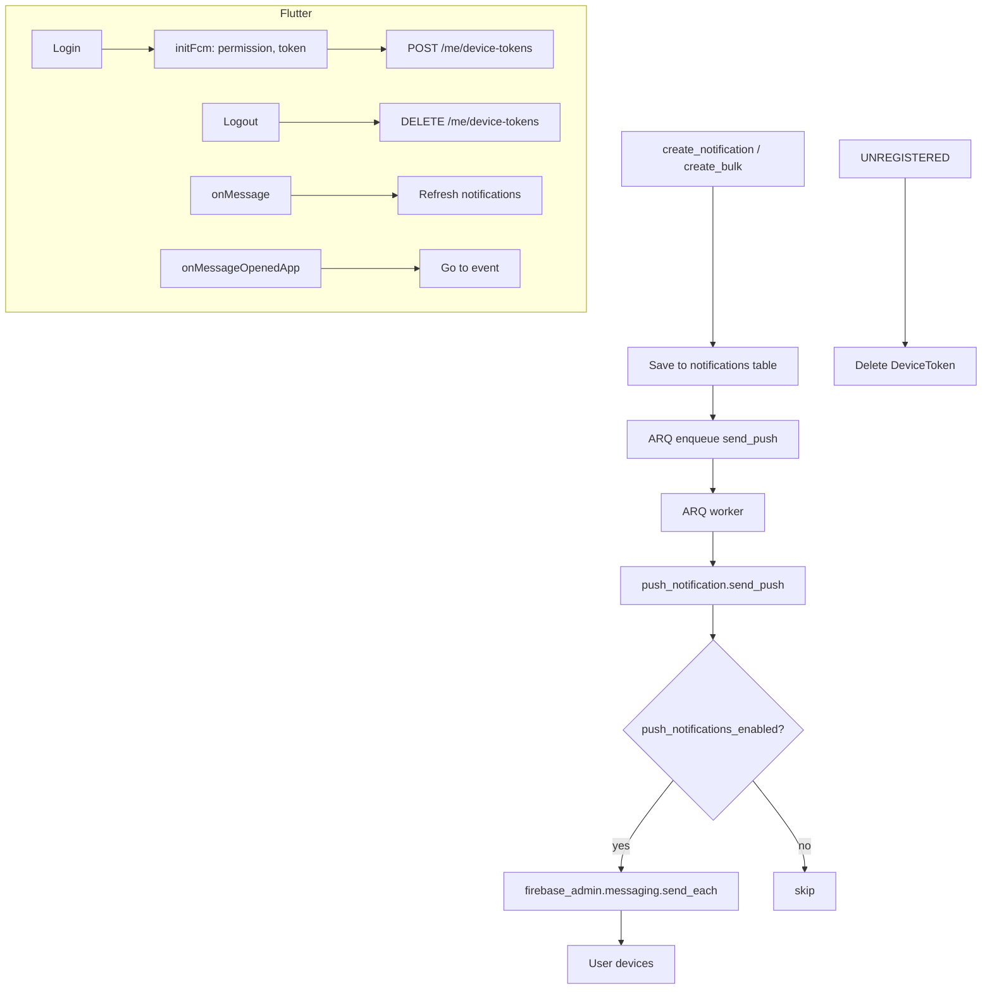

# FCM Push Notifications

## Initiator

- **Who:** System (when an in-app notification is created); User (on login: register device token; on logout: unregister).
- **When:** Every `create_notification()` and `create_bulk_notifications()` call enqueues an ARQ job to send FCM push to the user's devices. Frontend requests permission and registers the FCM token after auth; unregisters on logout.

## Frontend flow

- **Screen/Widget:** No dedicated screen. FCM is initialized when the user is authenticated; permission is requested via `NotificationProvider.initFcm()`; token is sent to backend via POST `/me/device-tokens`.
- **User action:** On login, app calls `initFcm()` (permission request, get token, register). On logout, `unregisterDevice()` calls DELETE `/me/device-tokens/{token}`. Foreground: `FirebaseMessaging.onMessage` refreshes notification list. Tap on notification: `onMessageOpenedApp` / `getInitialMessage` navigates to event detail using `data.event_id`.
- **API calls:** POST `/me/device-tokens` (body: `{ token, platform }`), DELETE `/me/device-tokens/{token}`. Both require auth.

## Backend routing

- **Entry:** `notifications.router` — POST `/me/device-tokens`, DELETE `/me/device-tokens/{token}`. Push sending is done in ARQ worker via `app.services.push_notification`.
- **Handler:** Device token endpoints upsert or delete `DeviceToken` rows. Push is sent asynchronously: notification_service enqueues `send_push_notification` or `send_push_notification_bulk`; worker runs `push_notification.send_push` / `send_push_bulk` which use `firebase_admin.messaging.send_each()`.

## Service layer

- **Module(s):** `app.services.push_notification` (send_push, send_push_bulk), `app.services.notification_service` (enqueues ARQ after create_notification / create_bulk_notifications), `app.worker.tasks` (send_push_notification, send_push_notification_bulk).
- **Main functions:**
  - `push_notification.send_push(db, user_id, title, body, data)` — checks `push_notifications_enabled`; loads user's device tokens; sends via FCM; removes stale tokens (UNREGISTERED).
  - `push_notification.send_push_bulk(db, user_ids, title, body, data)` — same for multiple users.
  - `notification_service.create_notification` / `create_bulk_notifications` — after saving to DB, enqueue ARQ job so push is sent without blocking the request.

## Models and DB

- **Models:** `DeviceToken` (user_id FK, token unique 512, platform android|ios|web, created_at, updated_at). Table: `device_tokens`.
- **Tables updated/read:** `device_tokens` (insert/update on POST device-tokens; delete on DELETE or when FCM returns UNREGISTERED). Notifications table unchanged; push is additive to in-app notifications.

## Dependencies

- **Requires:** [In-App Notifications](34-in-app-notifications.md) (push is triggered by the same create_notification/create_bulk_notifications flow), [Auth](01-auth-users.md), Firebase Admin SDK (already used for ID token verification; same app used for messaging). Platform setting `push_notifications_enabled` (admin toggle).
- **Triggers / side effects:** Every in-app notification creation enqueues an ARQ push job. If Redis/ARQ is down, enqueue is skipped (no exception). Stale FCM tokens are deleted when FCM returns UNREGISTERED.

## Prompt

Implement **FCM Push Notifications** for the Crowd Funding Event app. Backend: DeviceToken model and table; POST/DELETE `/me/device-tokens`; push_notification service using firebase_admin.messaging (send_push, send_push_bulk; respect push_notifications_enabled); ARQ tasks send_push_notification and send_push_notification_bulk; hook into create_notification and create_bulk_notifications to enqueue push. Frontend: firebase_messaging; request permission and register token on login; unregister on logout; onMessage (foreground) refresh list; onMessageOpenedApp and getInitialMessage for tap-to-navigate using data.event_id. Admin: push_notifications_enabled in platform_settings and Settings tab. Follow the flow, dependencies, and diagrams in this document.

## Flow diagram

## Vulnerabilities

- Device tokens are user-scoped; ensure DELETE only removes tokens belonging to current_user. Token is in URL path for DELETE — no sensitive data in token value beyond FCM identifier.
- If Firebase credentials are missing or invalid, push sending fails gracefully (log warning, no crash). Admin can disable via push_notifications_enabled.

## Improvements

- Per-notification-type toggle (e.g. disable push for certain types) could be added in push_notification service.
- Optional data payload size limits for FCM data map (currently small keys like event_id are safe).

## Feedback

- Push is sent in addition to in-app notifications; same title/message/data. Tap-to-navigate reuses existing event detail route. Admin toggle allows disabling push without code deploy. Stale token cleanup keeps device_tokens table small.
