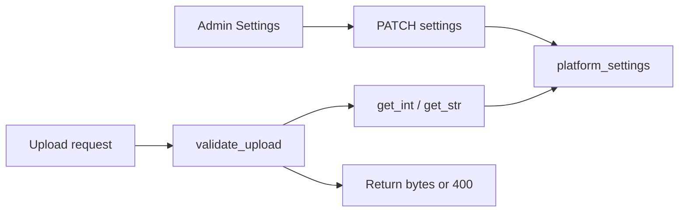

# Admin-Configurable File Upload Validation

## Initiator

- **Who:** Admin (via Settings tab — File Uploads group); system (every file upload endpoint validates against these settings).
- **When:** Admin edits upload size/type settings; on every image or document upload the validation helper reads current limits from platform settings.

## Frontend flow

- **Screen/Widget:** Admin Dashboard → Settings tab → **File Uploads** card. Four settings: max image size (MB), max document size (MB), allowed image MIME types (comma-separated), allowed document MIME types (comma-separated).
- **User action:** Admin edits values; save via PATCH `/admin/settings/{key}`. No frontend change for upload flows — validation is server-side only.
- **API calls:** Unchanged from caller perspective; upload endpoints return 400 with a clear message when type or size is invalid.

## Backend routing

- **Entry:** All upload endpoints call `app.services.upload_validation.validate_upload(db, file, category)` before writing to disk. Category is `"image"` or `"document"`.
- **Handler:** `validate_upload()` reads `upload_max_{category}_size_mb` and `upload_allowed_{category}_types` from platform_settings, checks `file.content_type` against the allowed set, reads file bytes and checks length. Returns bytes on success; raises `HTTPException(400)` on violation.

## Service layer

- **Module(s):** `app.services.upload_validation` (validate_upload), `app.services.platform_settings` (get_int, get_str).
- **Main functions:** `validate_upload(db, file, category)` — async; returns validated file bytes. Used by: `events/images.py` (event image upload), `schedule.py` (schedule item image upload), `sponsors/organizer_views.py` (both prerequisite document upload endpoints).

## Models and DB

- **Models:** None. Uses `PlatformSetting` for the four keys.
- **Tables updated/read:** `platform_settings` (read). Upload endpoints still write to static/uploads (event images, schedule images, prerequisites).

## Platform settings (4 keys)

- `upload_max_image_size_mb` — default 10; max size in MB for event and schedule image uploads.
- `upload_max_document_size_mb` — default 25; max size in MB for prerequisite document uploads.
- `upload_allowed_image_types` — default image/jpeg, image/png, image/webp, image/gif (comma-separated).
- `upload_allowed_document_types` — default application/pdf, image/jpeg, image/png, etc. (comma-separated).

## Dependencies

- **Requires:** [Feature Flags / Platform Settings](12-feature-flags.md), [Admin Dashboard](28-admin-dashboard.md). Used by [Event Images](24-event-images-gallery.md), [Event Schedule](13-event-schedule.md), [Sponsorship Prerequisites](37-sponsorship-prerequisites.md).
- **Triggers / side effects:** None. Validation is synchronous within the request; no cache invalidation.

## Prompt

Implement **Admin-Configurable File Upload Validation** for the Crowd Funding Event app. Backend: add four platform setting keys (upload_max_image_size_mb, upload_max_document_size_mb, upload_allowed_image_types, upload_allowed_document_types); create `upload_validation.validate_upload(db, file, category)` that reads limits and validates type and size, returning file bytes or raising HTTP 400. Replace hardcoded validation in event image upload and schedule image upload; add validation to prerequisite document uploads (which had none). Admin UI: File Uploads group in Settings with the four keys. Follow the flow, dependencies, and diagrams in this document.

## Flow diagram

## Vulnerabilities

- MIME type can be spoofed by client; server trusts `file.content_type`. For stricter security, consider magic-byte or extension checks in addition. Max size limits prevent disk exhaustion and DoS from huge uploads.
- Prerequisite uploads previously had no validation — now enforced via same helper.

## Improvements

- Optional: validate file magic bytes for images/documents. Optional: virus scan for document uploads in production.

## Feedback

- Single source of truth for limits; admin can tune without deploy. Prerequisite document uploads now have both type and size checks; event and schedule image uploads use the same configurable limits instead of hardcoded 10MB/5MB.
