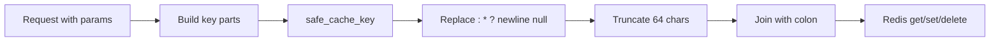

# Cache Key Injection Hardening

## Initiator

- **Who:** System (every cache read/write that builds keys from user or query input).
- **When:** Organizer dashboard request (query params: status, event_id, genre, period); platform setting read/write (key name). Keys are built via `safe_cache_key()` so user-controlled segments cannot inject colons, wildcards, or newlines.

## Frontend flow

- **Screen/Widget:** N/A. Transparent to frontend.
- **User action:** N/A.
- **API calls:** Unchanged. Dashboard and settings endpoints behave the same; keys are built safely on the server.

## Backend routing

- **Entry:** `app.cache.safe_cache_key(*parts)` used wherever a cache key is built from multiple parts (including user-supplied or query params).
- **Handler:** Dashboard handler in `users.py` builds key with `safe_cache_key("dashboard", current_user.id, status, event_id, genre, period)`. Platform settings `_get_raw()` and `set_value()` use `safe_cache_key("settings", key)`.

## Service layer

- **Module(s):** `app.cache` (safe_cache_key). No new service; helper used at key-construction sites.
- **Main functions:** `safe_cache_key(*parts)` — converts each part to string, replaces `: * ? \\n \\r \\x00` with underscore, truncates each segment to 64 chars, joins with colon. Prevents key collision and abuse of `cache_delete_pattern` (e.g. `genre=*` would not expand).

## Models and DB

- **Models:** None.
- **Tables updated/read:** None. Redis key format only.

## Dependencies

- **Requires:** [Redis Caching](49-redis-caching.md). Applied to dashboard cache key and settings cache key.
- **Triggers / side effects:** None. Key format changes are backward-incompatible for the same logical key if input contained unsafe chars (old key would differ from new); in practice query params are bounded so keys match.

## Prompt

Implement **Cache Key Injection Hardening** for the Crowd Funding Event app. Add `safe_cache_key(*parts)` to `app.cache`: sanitize string parts (strip colons, wildcards, newlines, nulls; truncate segment length). Apply to dashboard cache key in `users.py` (status, event_id, genre, period are query-derived) and to settings cache key in `platform_settings.py` (`_get_raw` and `set_value`). Follow the flow, dependencies, and diagrams in this document.

## Flow diagram

## Vulnerabilities

- Without sanitization, a crafted `genre` or `status` (e.g. containing `*` or `:`) could cause key collision or interact with `cache_delete_pattern()`. Low risk for current enum-like params; hardening is defensive.

## Improvements

- Audit other cache key construction sites (e.g. featured cache key, event detail key) and use `safe_cache_key` if they ever include user input.

## Feedback

- Minimal code surface; dashboard and settings were the only keys identified with user-controlled segments. Safe key builder is reusable for future cached endpoints.
