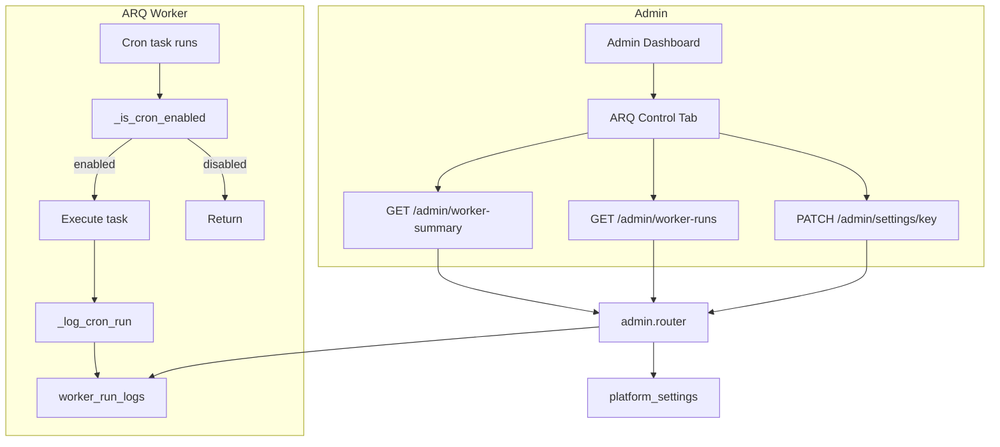

# ARQ Worker Control

## Initiator

- **Who:** Admin (view run logs, enable/disable cron jobs); System (logs each cron run automatically).
- **When:** Admin Dashboard → ARQ Control tab. Each ARQ cron execution is logged by the worker.

## Frontend flow

- **Screen/Widget:** Admin Dashboard → ARQ Control tab (`AdminArqTab`).
- **User action:** View cron job summary (name, schedule, enabled state, total runs, total errors, last run time, last status); toggle each job on/off via Switch (calls existing PATCH settings); view run log with filters (task_name, status); expand run rows to see error traceback.
- **API calls:** `adminGetWorkerSummary()` → GET `/admin/worker-summary`; `adminGetWorkerRuns(taskName, status, offset, limit)` → GET `/admin/worker-runs`. Toggles use existing `onUpdateSetting(key, value)` → PATCH `/admin/settings/{key}` for keys `arq_mock_auto_settle_enabled`, `arq_ticket_escrow_check_enabled`, `arq_sponsor_escrow_check_enabled`, `arq_scheduled_payouts_enabled`, `arq_daily_reconciliation_enabled`.

## Backend routing

- **Entry:** `api_router` → `admin.router` (prefix `/admin`).
- **Handler:** `admin.py` — GET `/worker-summary` (admin-only, returns list of tasks with enabled state, total_runs, total_errors, last_run_at, last_status); GET `/worker-runs` (admin-only, query params `task_name`, `status`, `offset`, `limit`, returns paginated run log items). Toggles use existing PATCH `/admin/settings/{key}`.

## Service layer

- **Module(s):** `app.worker.tasks` (cron tasks and logging helpers), `app.services.platform_settings` (get_bool for enable toggles).
- **Main functions:** Each of the 5 cron tasks calls `_is_cron_enabled(setting_key)` at start (returns False → task returns without running); on completion calls `_log_cron_run(task_name, status, started_at, duration_ms, items_processed=None, error=None)` to persist to `worker_run_logs`. No separate service module; logging is inline in `app.worker.tasks`. Platform settings: `platform_settings.get_bool(db, key)` for the five `arq_*_enabled` keys.

## Models and DB

- **Models:** `WorkerRunLog` in `app.models.worker_run_log` — `id`, `task_name` (string, indexed), `status` (success/error/skipped), `duration_ms` (float, nullable), `items_processed` (int, nullable), `error` (text, nullable), `started_at` (timestamp with timezone), `finished_at` (timestamp with timezone, nullable). Table `worker_run_logs`.
- **Platform settings (keys in platform_settings):** `arq_mock_auto_settle_enabled`, `arq_ticket_escrow_check_enabled`, `arq_sponsor_escrow_check_enabled`, `arq_scheduled_payouts_enabled`, `arq_daily_reconciliation_enabled` — all default `"true"`; when `false`, the corresponding cron task exits immediately without running.

## Dependencies

- **Requires:** [Auth](01-auth-users.md) (admin role for endpoints), [Admin Dashboard](28-admin-dashboard.md) (host for ARQ tab), [Feature Flags / Platform Settings](12-feature-flags.md) and [Cache TTL and Admin Toggle](50-cache-ttl-admin-toggle.md) (settings API for toggles). The cron tasks themselves are part of [Refund Processing](43-refund-processing.md), [Ticket & Sponsor Escrow](54-ticket-sponsor-escrow.md), [Banking](53-banking-financial-management.md), [Email Notifications](21-email-notifications.md) — the worker runs those flows; this feature only adds toggles and run logging.

## Prompt

Implement **ARQ Worker Control** for the Crowd Funding Event app. Backend: five platform settings `arq_*_enabled` (default true) to enable/disable each cron job; `WorkerRunLog` model and `worker_run_logs` table; each cron task checks the setting and logs every run (success/error/skipped) with duration and optional error text; GET `/admin/worker-summary` (tasks with enabled state, run counts, last run); GET `/admin/worker-runs` (paginated, filter by task_name, status). Frontend: Admin Dashboard ARQ Control tab with cron job cards (toggle Switch, stats, last run), run log list with task/status filters and expandable error details. Follow the flow, dependencies, and diagrams in this document.

## Flow diagram

## Vulnerabilities

- All endpoints are admin-only; ensure `require_role(UserRole.admin)` is applied. Run log may contain stack traces (sensitive); restrict access and consider truncation (already truncated to 500 chars in code). Consider retention or purge policy for `worker_run_logs` to avoid unbounded growth.

## Improvements

- Optional: retention policy for run logs (e.g. delete or archive rows older than N days). Optional: "Run now" trigger per task from admin (would require an admin-only endpoint that enqueues the task once, without changing cron schedule).

## Feedback

- Toggles and run log give operators visibility and control over cron jobs without redeploying the worker. Run log status and error field make debugging failed runs straightforward.
