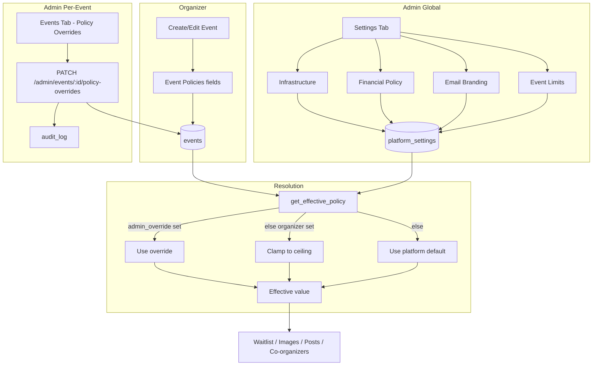

# Admin Settings Expansion

## Initiator

- **Who:** Admin (global platform settings, event-limit ceilings, per-event policy overrides); Organizer (per-event policy values when creating or editing an event).
- **When:** Admin Dashboard → Settings tab (Infrastructure, Financial Policy, Email Branding, Event Limits groups); Admin → Events tab → Policy Overrides (per event); Organizer → Create/Edit Event → Event Policies section. Effective values are resolved at runtime: admin override > organizer value > global default.

## Frontend flow

- **Admin Settings tab:** New groups in `AdminSettingsTab`: **Infrastructure** (worker_run_log_retention_days, notification_retention_days, device_token_retention_days, cron_*), **Financial Policy** (payout_minimum_cents, max_events_per_organizer, escrow_trust_score_threshold, max_dispute_days_after_event, max_push_notifications_per_hour, email_digest_enabled), **Email Branding** (email_template_logo_url, email_template_footer_text), **Event Limits** (waitlist_max_size_limit, waitlist_auto_approve_default, event_max_images_limit, max_posts_per_event_limit, max_co_organizers_limit, refund_deadline_percent_min, refund_deadline_percent_max), **Stripe integration** (stripe_enabled, stripe_publishable_key, stripe_secret_key, stripe_webhook_secret, stripe_connect_enabled). Same GET/PATCH settings API as existing groups. When admin sets stripe_enabled to true, all admins receive a settings_warning in-app notification (see [34](34-in-app-notifications.md)).
- **Create/Edit Event:** Event Policies section (create: expansion tile in Location step; edit: ExpansionTile in edit form). Fields: waitlist max size, waitlist auto-approve (switch), max images, max posts per day, max co-organizers, refund deadline %. Values are optional; empty uses platform default (respecting ceilings).
- **Admin Events tab:** Each event card has a "Policy Overrides" (tune) icon; opens dialog with five override fields (waitlist_max_size, event_max_images, max_posts_per_day, max_co_organizers, refund_deadline_percent). Save calls `adminSetPolicyOverrides(eventId, overrides)` → PATCH `/admin/events/{event_id}/policy-overrides`.
- **API calls:** Existing GET/PATCH for settings; event create/update include new policy fields; `getCoOrganizedEvents` and event detail already return policy and effective_* when applicable; `adminSetPolicyOverrides(eventId, body)` for overrides.

## Backend routing

- **Entry:** `admin.router` — PATCH `/admin/events/{event_id}/policy-overrides` (admin-only; body: optional admin_override_* fields; logs to audit; returns overrides + effective policy). Settings use existing GET/PATCH `/admin/settings` (keys in new groups). Event create/update in `events/crud.py` accept new body fields and pass to service.
- **Event detail:** GET `/{event_id}` builds response with `effective_policy` from `get_effective_policy(db, event)` and includes policy + effective_* in `EventResponse`.

## Service layer

- **Module(s):** `app.services.platform_settings` (20 new DEFAULTS + DESCRIPTIONS), `app.services.event.crud` (ceiling clamping in create/update, `get_effective_policy()`), `app.services.escrow` (trust threshold from settings), `app.services.email_templates` (branding cache + `load_branding(db)`), `app.worker.main` (cron schedule from settings at boot), `app.worker.tasks` (`cleanup_old_records` cron, retention from settings).
- **Main functions:** `get_effective_policy(db, event)` returns dict of resolved values (admin_override > organizer > global default) for waitlist_max_size, event_max_images, max_posts_per_day, max_co_organizers, refund_deadline_percent. Enforcement: registration (waitlist size), event images upload (image count), post creation (posts per day), add co-organizer (co-organizer count). Refund deadline percent in create/update uses `refund_deadline_percent_max` (replacing hardcoded 0.2). Event create checks `max_events_per_organizer` before allowing new event.

## Models and DB

- **Models:** `Event` in `app.models.event` — 6 organizer columns: `waitlist_max_size`, `waitlist_auto_approve`, `event_max_images`, `max_posts_per_day`, `max_co_organizers`, `refund_deadline_percent`; 5 admin override columns: `admin_override_waitlist_max_size`, `admin_override_event_max_images`, `admin_override_max_posts_per_day`, `admin_override_max_co_organizers`, `admin_override_refund_deadline_percent`. All nullable except `waitlist_auto_approve` (default True).
- **Migration:** `eee_add_event_policy_columns.py` (revision `eee_event_policy_columns`, down_revision `ddd_add_escrow_auto_release`).
- **Platform settings:** New keys in `platform_settings` (see Initiator/Frontend), including **Stripe**: stripe_enabled, stripe_publishable_key, stripe_secret_key, stripe_webhook_secret, stripe_connect_enabled; no new tables beyond existing `platform_settings` and `events` columns.

## Dependencies

- **Requires:** [Auth](01-auth-users.md) (admin for overrides and settings, organizer for event policies), [Admin Dashboard](28-admin-dashboard.md), [Feature Flags](12-feature-flags.md) / [Cache TTL and Admin Toggle](50-cache-ttl-admin-toggle.md) (settings API), [Events CRUD & Lifecycle](03-events-crud-lifecycle.md), [Fund Escrow](29-fund-escrow.md), [Ticket & Sponsor Escrow](54-ticket-sponsor-escrow.md), [Email Notifications](21-email-notifications.md), [ARQ Worker Control](65-arq-worker-control.md) (cron toggles and run log; cleanup_old_records uses retention settings).
- **Triggers / side effects:** Cron schedule and retention settings take effect on ARQ worker restart. Email branding is cached per process (call `load_branding(db)` before sending). Policy overrides are audited via `audit_svc.log_action`.

## Prompt

Implement **Admin Settings Expansion** for the Crowd Funding Event app. Three tiers: (1) Admin global settings — Infrastructure (worker/notification retention, cron hours/interval), Financial Policy (payout minimum, max events per organizer, escrow trust threshold, dispute days, push cap, email digest), Email Branding (logo URL, footer text); wire these into escrow, worker, email_templates, event create. (2) Per-event organizer settings — platform ceilings in settings; Event model columns (6 organizer + 5 admin override); EventCreate/EventUpdate/EventResponse; ceiling validation and `get_effective_policy()`; enforce at waitlist, images, posts, co-organizers. (3) Admin per-event overrides — PATCH `/admin/events/{event_id}/policy-overrides`, audit log; Policy Overrides dialog in admin events tab. Add cleanup_old_records cron for retention. Follow the flow, dependencies, and diagrams in this document.

## Flow diagram

## Vulnerabilities

- Admin override bypasses organizer and ceiling; ensure only admin can call policy-overrides. Cron and retention settings take effect on worker restart — document for operators. Run log and notification retention delete data; ensure retention_days are sane. Email branding cache is process-local; multi-worker deployments may need cache invalidation or shared config.

## Improvements

- Optional: Admin UI note that cron schedule changes require worker restart. Optional: retention policy for worker_run_logs and notifications configurable per type. Optional: bulk policy-override or template for events.

## Feedback

- Three-tier model (global defaults, organizer per-event, admin per-event override) gives platform control while letting organizers tune within limits. Operators can adjust infrastructure and financial policy without code changes. Per-event overrides allow handling edge cases (e.g. high-profile event) without changing organizer-facing defaults.
