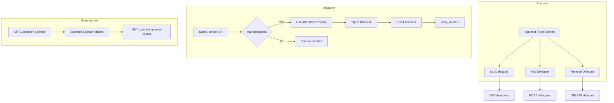

# Sponsor Delegates

## Initiator

- **Who:** Sponsor (add/remove delegates on their ticket); Organizer (scan sponsor QR, check in delegates).
- **When:** Sponsor Ticket screen (receipt/detail) → Delegates section; Ticket Scanner (sponsor mode) → scan sponsor QR → live attendance popup.

## Frontend flow

- **Screens/Widgets:**
  - **Sponsor Ticket screen** (`lib/screens/sponsor/sponsor_ticket_screen.dart`): Receipt/detail page includes a **Delegates** section — list of delegates (name, email, phone, checked-in badge + timestamp), **Add Delegate** button (dialog: name required, email/phone optional), delete icon on unchecked delegates only.
  - **Ticket Scanner** (`lib/screens/event/ticket_scanner_screen.dart`): In sponsor mode, when a sponsor ticket **with delegates** is scanned, a **live attendance tracker** bottom sheet opens: header (company name, receipt, "Checked in: X of Y"), full delegate list (checked-in: green check + timestamp; not checked-in: tap to check in). Single tap on an unchecked delegate calls check-in API; row animates to checked-in; counter updates. When the sponsor ticket has **no delegates**, existing "Sponsor Verified" popup is shown and `scan_count` is incremented as before.
  - **Scanned Tickets list** (`lib/screens/event/ticket_sales_screen.dart`): When viewing scanned tickets only, a filter toggle **All | Customer | Sponsor** is shown. **Sponsor** shows scanned sponsor tickets (company, receipt, scan count, delegates with check-in status). **All** shows both customer and sponsor tickets; sponsor cards have a SPONSOR badge and delegate info.
- **API calls:** `listDelegates(ticketId)`, `addDelegate(ticketId, name, email?, phone?)`, `removeDelegate(ticketId, delegateId)`, `checkInDelegate(eventId, delegateId)`, `getScannedSponsorTickets(eventId)`, `scanSponsorTicket(eventId, payload)` (response includes `delegates`, `total_delegates`, `checked_in_count`, `unchecked_count`).
- **Frontend modules:** `lib/models/sponsor.dart` (`SponsorDelegate`), `lib/services/api_service.dart` (delegate + scanned-sponsor-tickets methods).

## Backend routing

- **Entry:** `sponsors.router` → `delegates.router`, `tickets.router`.
- **Handlers:**
  - GET `/me/sponsor-tickets/{ticket_id}/delegates` — list delegates (owner only).
  - POST `/me/sponsor-tickets/{ticket_id}/delegates` — add delegate (body: name, email?, phone?); max delegates from platform setting `max_sponsor_delegates_per_ticket` (default 5).
  - DELETE `/me/sponsor-tickets/{ticket_id}/delegates/{delegate_id}` — remove delegate (owner only; cannot remove if already checked in).
  - POST `/events/{event_id}/sponsor-delegates/{delegate_id}/check-in` — check in delegate (organizer/scan permission); increments `SponsorTicket.scan_count` and sets delegate `checked_in` / `checked_in_at`.
  - GET `/events/{event_id}/scanned-sponsor-tickets` — list sponsor tickets with `scan_count > 0` for event (organizer/scan permission), including delegates.
  - POST `/events/{event_id}/scan-sponsor` — unchanged path; response now includes `delegates`, `total_delegates`, `checked_in_count`, `unchecked_count`; when delegates exist, scan does **not** increment `scan_count` (only check-in does).

## Service layer

- **Module(s):** `app.services.sponsor.delegates` (list_delegates, add_delegate, remove_delegate, check_in_delegate), `app.services.sponsor.tickets` (scan_sponsor_ticket updated to load and return delegates; when ticket has delegates, no direct scan_count increment).
- **Main functions:** add_delegate enforces max count and unique email per ticket; remove_delegate forbids removal if checked_in; check_in_delegate sets delegate.checked_in, delegate.checked_in_at, increments ticket.scan_count, sets ticket.scanned_at if first.

## Models and DB

- **Models:** `SponsorDelegate` (id, sponsor_ticket_id, name, email, phone, checked_in, checked_in_at, created_at). `SponsorTicket` has relationship `delegates`; scan_count/scanned_at updated on delegate check-in.
- **Tables:** `sponsor_delegates` (FK to sponsor_tickets.id; unique on sponsor_ticket_id + email). Migration: `fff_add_sponsor_delegates`.
- **Platform setting:** `max_sponsor_delegates_per_ticket` (int, default 5) in `platform_settings` DEFAULTS.

## Dependencies

- **Requires:** [Auth](01-auth-users.md), [39 Sponsor Ticket Scan Count](39-sponsor-ticket-scan-count.md), [07 Co-Organizer](07-co-organizer-management.md) (scan permission).
- **Triggers / side effects:** Check-in updates SponsorTicket.scan_count and scanned_at; delegate list and scanned-sponsor-tickets read SponsorTicket + delegates.

## Prompt

Implement **Sponsor Delegates** for the Crowd Funding Event app. Backend: SponsorDelegate model and table; CRUD + check-in service and API (list/add/remove delegates, check-in by organizer); scan_sponsor_ticket returns delegates and does not increment scan_count when delegates exist; GET scanned-sponsor-tickets for organizer. Frontend: Sponsor ticket receipt page — delegates section with add dialog and delete; scanner — when sponsor ticket has delegates, show live attendance popup with tap-to-check-in; ticket sales scanned view — filter All/Customer/Sponsor and sponsor cards with delegate status. Follow the flow, dependencies, and diagrams in this document.

## Flow diagram

## Vulnerabilities

- Delegate check-in is idempotent (already_checked_in in response); rate limit on check-in endpoint (qr_scan). Only ticket owner can add/remove delegates; only organizer with scan permission can check in.

## Improvements

- Optional cap on total delegates per event per sponsor across multiple tickets. Audit log for delegate check-ins if needed.

## Feedback

- Live attendance popup keeps sheet open for rapid multi-check-in. Combined scanned list (All) shows both customer and sponsor tickets with clear SPONSOR badge and delegate counts.
