# Escrow Bank Account Guard

## Initiator

- **Who:** Organizer (add/verify bank account); Admin (approve event, verify/reject bank, retry failed refunds); System (auto-release guard, mock bank verify, refund failure notifications).
- **When:** Event approval blocked until organizer has verified bank; escrow auto-release skipped if no verified bank; bank account create/update resets verification and enqueues mock auto-verify; manual unfreeze without bank warns admins; refund failures notify admins + organizer; organizer can request refund retry; admin can retry failed refunds.

## Frontend flow

- **Screens/Widgets:** Organizer: Banking/Profile (bank account form, verification status, rejection reason); Event approval (admin sees error if no bank). Admin: Event approval (must have verified bank); Banking (verify/reject bank per user); Refunds (retry failed ticket/pledge/sponsor). Organizer: Event/refund view (request refund retry button when failed refunds exist).
- **API calls:** GET/PUT `/me/bank-account`, DELETE `/me/bank-account` (blocked if active escrow); Admin: POST `/admin/bank-accounts/{user_id}/verify`, POST `/admin/bank-accounts/{user_id}/reject`; Organizer: POST `/me/events/{event_id}/request-refund-retry` (rate-limited 1/hour); Admin: POST `/admin/refunds/ticket/{id}/retry`, `/admin/refunds/pledge/{id}/retry`, `/admin/refunds/sponsor/{id}/retry`, POST `/admin/refunds/retry-all/{event_id}`.
- **Frontend modules:** Banking/Profile screens show `verification_status`, `rejection_reason`; admin banking/refund UIs call new endpoints; organizer event/refund screen can call request-refund-retry.

## Backend routing

- **Entry:** `banking.router` (PUT/GET/DELETE `/me/bank-account`, request-refund-retry, admin verify/reject); `admin.router` (event approval uses admin service; refund retry endpoints).
- **Handlers:**
  - PUT `/me/bank-account`: Save/update bank; set verified=false, verification_status=pending; send `bank_verification_pending`; enqueue `mock_verify_bank_account` with delay from `bank_verification_delay_seconds`.
  - DELETE `/me/bank-account`: Reject if organizer has active escrow (holding/partially_released); else delete.
  - POST `/admin/bank-accounts/{user_id}/verify`: Set verified=true, verification_status=verified; notify organizer `bank_verified`.
  - POST `/admin/bank-accounts/{user_id}/reject`: Body reason; set verified=false, verification_status=rejected, rejection_reason; notify organizer.
  - POST `/me/events/{event_id}/request-refund-retry`: Organizer only; count refund_failed for event; if > 0, send `refund_retry_requested` to all admins; return `{ requested: count }`; rate limit 1/hour.
  - POST `/admin/refunds/ticket/{ticket_sale_id}/retry`, `/admin/refunds/pledge/{funding_id}/retry`, `/admin/refunds/sponsor/{payment_id}/retry`: Validate status=refund_failed; set refund_processing; re-enqueue ARQ task; return re-enqueued.
  - POST `/admin/refunds/retry-all/{event_id}`: Retry all refund_failed (tickets, pledges, sponsors) for event; return counts.

## Service layer

- **Module(s):** `app.services.escrow_base` (organizer_has_verified_bank, get_organizer_for_event, get_all_admin_ids, has_active_escrow, _warn_admins_if_no_bank, rollback_release); `app.services.admin` (approve_or_reject_event checks bank before approve); `app.services.escrow`, `app.services.ticket_escrow`, `app.services.sponsor_escrow` (_check_bank_guard before each auto-release; unfreeze calls _warn_admins_if_no_bank); `app.services.refund_retry` (retry_ticket_refund, retry_pledge_refund, retry_sponsor_refund, retry_all_for_event, count_failed_refunds_for_event).
- **Main logic:** Auto-release (fund/ticket/sponsor) runs trigger checks; if pass, _check_bank_guard: if no verified bank, send escrow_payout_blocked to organizer and return without releasing. generic_unfreeze and fund unfreeze call _warn_admins_if_no_bank after unfreezing. ARQ failure handlers (_mark_ticket_failed, _mark_funding_failed, _mark_sponsor_payment_failed) call _notify_refund_failure: admins get ticket_refund_failed/pledge_refund_failed/sponsor_refund_failed; organizer gets refund_delayed_organizer.

## Models and DB

- **Models:** `OrganizerBankAccount` extended with `verification_status` (BankVerificationStatus: pending, verified, rejected), `rejection_reason`. `NotificationType` extended with escrow_payout_blocked, escrow_unfreeze_warning, bank_verification_pending, bank_verified, ticket_refund_failed, pledge_refund_failed, sponsor_refund_failed, refund_delayed_organizer, refund_retry_requested. `EscrowRelease` used by rollback_release (release_status rolled_back).
- **Tables:** `organizer_bank_accounts` (new columns); `notifications` (new type values). Migration: `ggg_escrow_bank_guard` (ALTER TYPE notificationtype ADD VALUE …; bankverificationstatus enum; verification_status, rejection_reason on organizer_bank_accounts).
- **Platform setting:** `bank_verification_delay_seconds` (int, default 10) for mock auto-verify delay.

## Dependencies

- **Requires:** [29 Fund Escrow](29-fund-escrow.md), [54 Ticket & Sponsor Escrow](54-ticket-sponsor-escrow.md), [53 Banking & Financial Management](53-banking-financial-management.md), [43 Refund Processing](43-refund-processing.md), [34 In-App Notifications](34-in-app-notifications.md), [28 Admin Dashboard](28-admin-dashboard.md).
- **Related:** Rollback on failed payout (Part 8) uses `escrow_base.rollback_release`; payout worker should call it when gateway fails and notify organizer + admins. Refund failure notifications (Part 9) and admin/organizer retry (Part 10) extend [43 Refund Processing](43-refund-processing.md).

## Prompt

Implement **Escrow Bank Account Guard** for the Crowd Funding Event app. Backend: (1) New notification types and bank verification_status/rejection_reason; (2) escrow_base helpers (organizer_has_verified_bank, get_organizer_for_event, get_all_admin_ids, has_active_escrow, _warn_admins_if_no_bank, rollback_release); (3) Bank verification: PUT bank resets verification, enqueues mock_verify_bank_account; DELETE bank blocked if active escrow; admin verify/reject endpoints; (4) Event approval requires verified bank; (5) Fund/ticket/sponsor escrow auto-release guarded by bank check, notify organizer if skipped; (6) Manual unfreeze warns all admins if no bank; (7) Refund failure: notify admins (technical) + organizer (soft), admin retry endpoints, organizer request-refund-retry (rate-limited). Follow the flow, dependencies, and diagrams in this document.

## Flow diagram

```mermaid
flowchart TD
  subgraph approval [Event Approval]
    OrgSubmit[Organizer submits event] --> AdminApprove{Admin approves?}
    AdminApprove -->|Yes| BankGate{Verified bank?}
    BankGate -->|Yes| Approved[Event approved]
    BankGate -->|No| Rejected["Error: add bank first"]
  end

  subgraph autoRelease [Auto-Release]
    Cron[Cron: check_escrow_stages] --> TriggerMet{Trigger met?}
    TriggerMet -->|No| Skip1[Skip]
    TriggerMet -->|Yes| BankCheck{Verified bank?}
    BankCheck -->|Yes| Release[release_stageN]
    BankCheck -->|No| NotifyOrg[Notify organizer]
    NotifyOrg --> SkipRelease[Skip, retry next cron]
  end

  subgraph unfreeze [Manual Unfreeze]
    AdminUnfreeze[Admin unfreezes] --> Unfrozen[generic_unfreeze]
    Unfrozen --> BankCheck2{Verified bank?}
    BankCheck2 -->|Yes| OK[Done]
    BankCheck2 -->|No| WarnAdmins[Notify all admins]
  end

  subgraph refundFailure [Refund Failure]
    ARQFail[ARQ: refund failed] --> NotifyAdmins[Notify admins]
    ARQFail --> NotifyOrg2[Notify organizer soft]
    NotifyOrg2 --> OrgRequest[Organizer: request-refund-retry]
    OrgRequest --> NotifyAdmins2[Admins: retry requested]
    NotifyAdmins --> AdminRetry[Admin: POST retry]
    AdminRetry --> ReEnqueue[Re-enqueue ARQ]
  end
```

## Vulnerabilities

- Bank details encrypted at rest; admin verify/reject does not see raw account numbers. Rate limit on request-refund-retry (1/hour) prevents organizer spam. Retry endpoints validate refund_failed status only. Escrow guard does not block manual admin release (admin can still release; unfreeze warns if no bank).

## Improvements

- Throttle escrow_payout_blocked to once per event+stage per 24h. Throttle refund_delayed_organizer to once per event per 24h. Integrate real payout worker with rollback_release on gateway failure. Optional: organizer dashboard banner when bank unverified and escrow trigger met.

## Feedback

- Event approval gate ensures every approved event has a verified bank. Auto-release skip is silent except for organizer notification; next cron retries. Refund failure path gives admins technical detail and organizer a soft message; organizer can request retry without executing it.
