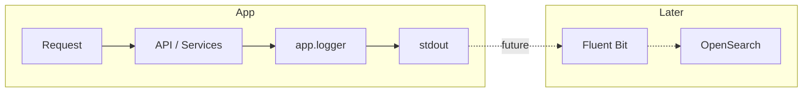

# Structured JSON Logging (stdout, OpenSearch-ready)

## Initiator

- **Who:** System (every request, every service call, every worker task). No direct user initiator; logging is transparent to the product flow.
- **When:** App startup (logging level from `LOG_LEVEL`), every API request (middleware), every mutation and important step in API and service layers, and every ARQ task. Logs go to stdout (console); later can be collected by Fluent Bit and shipped to OpenSearch.

## Frontend flow

- **Screen/Widget:** N/A. No frontend change. Logging is backend-only; stdout is captured by the container/runtime (Docker/Kubernetes).
- **User action:** N/A.
- **API calls:** Unchanged. Request logging is done in `LogRequestsMiddleware` (method, path, status, duration).

## Backend routing

- **Entry:** `main.py` — `setup_logging(settings.LOG_LEVEL)` at startup; root logger and all child loggers use a single JSON formatter writing to stdout.
- **Handler:** No dedicated “logging” route. Every router and service that uses `get_logger(...)` and `log_step(...)` emits JSON lines. Middleware in `main.py` logs each HTTP request (method, path, status_code, duration_ms).

## Service layer

- **Module(s):** `app.logger` (central module).
- **Main functions:**
  - `setup_logging(level="INFO")` — configures root logger with `JSONFormatter`, stdout handler, and optional level (from `LOG_LEVEL` env). Called once from `main.py` (and from `worker/main.py` for ARQ).
  - `get_logger(name: str) -> logging.Logger` — returns a named logger (e.g. `api.auth`, `svc.ticket.sales`). Used by all API and service modules.
  - `log_step(logger, msg, *args, **extra_fields)` — logs at INFO with `[STEP] ` prefix and optional structured fields (e.g. `user_id`, `event_id`) for step-style tracing.
  - `JSONFormatter` — formats each record as a single JSON line: `time`, `level`, `logger`, `msg`, plus any `extra` keys (and `exception` when present). Ready for OpenSearch/Loki ingestion.

## Models and DB

- **Models:** None. Logging is in-memory → stdout; no new tables or schema.
- **Tables updated/read:** None. Logging does not touch the database.

## Dependencies

- **Requires:** [Auth](01-auth-users.md) (for user context in logs where applicable), [Config / Feature Flags](12-feature-flags.md) (LOG_LEVEL in settings). No feature depends on this; it is cross-cutting infrastructure.
- **Triggers / side effects:** All API endpoints (auth, admin, banking, events, sponsors, milestones, users, ratings, notifications), all relevant services (auth, admin, registration, ledger, reconciliation, event lifecycle/attendance/permissions/queries, funding pledges/reservations, ticket sales/pricing/tiers, sponsor bids/payments/delegates/profile, milestone, discount, audit, venue), core (firebase, security), db base, dependencies, worker main and tasks. Existing modules that used `logging.getLogger` were migrated to `get_logger` from `app.logger`.

## Prompt

Implement **Structured JSON Logging** for the Crowd Funding Event backend. Single module `app.logger`: `JSONFormatter` (one JSON object per line to stdout), `setup_logging(level)`, `get_logger(name)`, `log_step(logger, msg, *args, **extra)`. Config: `LOG_LEVEL` in `app.config` (default INFO). Wire `setup_logging(settings.LOG_LEVEL)` in `main.py` and in `worker/main.py`. Add step/info/debug/warning logs across API and service layers (auth, admin, banking, events, sponsors, milestones, users, ratings, notifications, ledger, reconciliation, funding, ticket, sponsor, milestone, discount, audit, venue, core firebase/security, db, dependencies). Migrate existing `logging.getLogger` usages to `get_logger`. No frontend change. Logs are stdout-only; OpenSearch/Fluent Bit integration is a later upgrade.

## Flow diagram

## Vulnerabilities

- Do not log raw secrets (tokens, passwords, full card numbers). Mask or omit sensitive fields in `extra`. Log level in production should usually be INFO; DEBUG can expose internal IDs and flow details.
- Ensure JSON formatter does not raise on non-serializable values (use `default=str` or equivalent when serializing).

## Improvements

- Optional: add `LOG_FORMAT` (json | text) to switch to human-readable format in development. Optional: request_id or trace_id in every log line for distributed tracing. When adding OpenSearch: document Fluent Bit config and index template for the JSON fields (`level`, `logger`, `msg`, `user_id`, `event_id`, etc.).

## Feedback

- JSON to stdout gives a single, consistent format for local debugging and for future log aggregation (OpenSearch). Step-level and structured fields make it easy to search and filter (e.g. by `level:ERROR`, `logger:svc.ticket.sales`, `event_id:7`). No file rotation or disk usage in-app; the runtime (Docker/K8s) and collector handle persistence.
