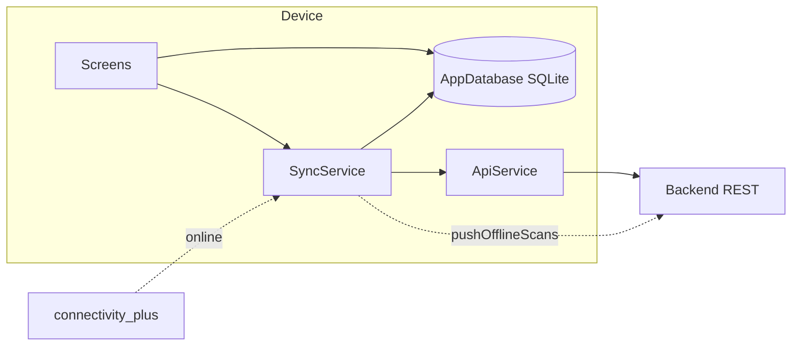

# Offline Sync & Local Cache

## Initiator

- **Who:** User (browse events offline, prepare tickets for offline scanning, view my tickets / sponsor tickets / event schedule offline); App (sync on launch and when connectivity is restored).
- **When:** App start (SyncService.init, syncOnLaunch if online); Home tab (pull events, read from cache); Organizer downloads tickets for an event ("Prepare Offline"); Ticket scanner uses local tickets when offline and queues scans for push; My Tickets / Sponsor Tickets / Event Detail read from local DB when offline; connectivity restored triggers pushOfflineScans.

## Frontend flow

- **Screen/Widget:** Home tab (pull events, show cached events for explore/list); Ticket Scanner (offline mode: scan from OfflineTickets, record to OfflineScans; when online, push scans and optionally refresh); My Tickets (pullMyTickets on load, fallback to CachedMyTickets); **TicketsBottomSheet** (searchable list of customer’s purchased tickets for active events only—selling_tickets or live—tap to open receipt); Event Detail (cache schedule and transport for event; read from CachedScheduleItems / CachedTransport when offline); Sponsor Ticket screen (pullSponsorTickets, read CachedSponsorTickets and CachedSponsorDelegates); Manage tab / event list can show "Prepare Offline" to download tickets for an event.
- **User action:** Open app (sync on launch if online); pull-to-refresh or explicit "Sync" to pull events; organizer taps "Prepare Offline" for an event to download all ticket sales to the device; at venue without network, organizer scans tickets from local list (scans stored in OfflineScans); when back online, queued scans are pushed to the server; customer/sponsor views my tickets or sponsor tickets from cache when offline.
- **API calls:** SyncService uses ApiService: getEvents (pullEvents), getTicketSales (downloadTicketsForEvent), getMyTickets (pullMyTickets), getSchedule (cacheScheduleForEvent), getMySponsorTickets (pullSponsorTickets), scanTicket (pushOfflineScans), getBookmarks (pullBookmarks). When offline, UI reads only from AppDatabase.

## Backend routing

- No new backend endpoints specific to "offline sync." Existing APIs are used: GET events, GET ticket-sales, GET my-tickets, GET schedule, GET sponsor tickets, POST scan-ticket. Backend may expose cursor or settings used by pull (e.g. event list pagination).

## Service layer (frontend)

- **Module(s):** `FrontEnd/lib/services/sync_service.dart`, `FrontEnd/lib/db/app_database.dart` (Drift).
- **SyncService:** `init()` subscribes to connectivity (wrapped in try/catch for web where connectivity_plus may be unavailable); `dispose()` cancels subscription and timers. `pullEvents()` (first ~40 events), `downloadTicketsForEvent(eventId)` (up to 5000 tickets for one event), `pullMyTickets()` (only caches tickets whose event status is `selling_tickets` or `live`), `cacheScheduleForEvent(eventId)`, `cacheTransportForEvent(...)`, `pullSponsorTickets()`, `cacheSponsorDelegates(ticketId, data)`, `pullBookmarks()`. `pushOfflineScans()` sends unsynced OfflineScans via scanTicket API and marks them synced. `syncOnLaunch()` when online runs pullEvents, pullMyTickets, pullSponsorTickets, pullBookmarks, pushOfflineScans. `isOnline` uses connectivity_plus (on web, returns true if plugin throws). On connectivity restored, `pushOfflineScans()` is called so queued scans are flushed.
- **AppDatabase (Drift):** Local SQLite. Tables: CachedEvents, CachedVenues, CachedTicketTiers, OfflineTickets, OfflineScans, CachedMyTickets, CachedScheduleItems, CachedTransport, CachedSponsorTickets, CachedSponsorDelegates, CachedBookmarks, SyncMetadata. Upsert/replace/clear methods per table. On web, Drift uses sqlite3.wasm and drift_worker.js for async SQLite in the browser.

## Models and DB (local only)

- **Local DB:** SQLite via Drift. Schema in `app_database.dart`; generated code in `app_database.g.dart`. CachedEvents (id, title, description, genre, status, startTime, endTime, lat, lng, venueName, city, firstImageUrl, fundingGoalCents, totalPledgedCents, ticketsSoldCount, syncedAt). OfflineTickets (id, eventId, ticketCode, userId, userName, tierName, status, scannedLocally, syncedAt). OfflineScans (id, ticketCode, eventId, scannedAt, scannedById, synced). CachedMyTickets (includes encryptedQrPayload for offline display). CachedScheduleItems, CachedTransport, CachedSponsorTickets, CachedSponsorDelegates, CachedBookmarks, SyncMetadata (syncTableName, lastSyncAt, lastSyncCursor).
- **Backend:** No schema change for offline; existing event, ticket-sales, and scan APIs are used.

## Dependencies

- **Requires:** [Auth](01-auth-users.md) (user context for API calls), [Tickets](19-tickets.md) (ticket sales, scan API), [Events](03-events-crud-lifecycle.md) (events list, schedule), [Event Discovery](06-event-discovery-search.md) (events API), [Sponsor Delegates](67-sponsor-delegates.md) (delegates cache). Flutter: `drift`, `drift_flutter`, `connectivity_plus`. Web: `sqlite3.wasm`, `drift_worker.js` for SQLite in browser.

## Prompt

Implement **Offline Sync & Local Cache** for the Crowd Funding Event app. Frontend: Drift/SQLite local DB (cached events, venues, ticket tiers, offline tickets, offline scans, my tickets, schedule, transport, sponsor tickets, delegates, bookmarks, sync metadata). SyncService: pull events/tickets/my-tickets/schedule/sponsor-tickets/bookmarks from API into local DB; download tickets for event (Prepare Offline); push offline scan records to server when online; syncOnLaunch and connectivity listener. Ticket scanner: when offline, scan from OfflineTickets and write to OfflineScans; when online, push scans and use API. My Tickets and Sponsor Ticket screens read from cache when offline. Event detail caches schedule and transport. No new backend endpoints; use existing REST APIs.

## Flow diagram

## Vulnerabilities

- Offline scans are pushed with current user as scannedBy; ensure scanner is authenticated before allowing offline mode. Local DB may contain sensitive data (QR payloads, ticket codes); protect device storage. Push sync is best-effort (retry on next connectivity); duplicate scan submissions could occur if server accepts and client retries—backend scan endpoint should be idempotent (e.g. by ticket_code + event_id).

## Improvements

- Incremental pull (e.g. by cursor) for events to avoid re-downloading full list. Conflict resolution if same ticket scanned offline and online. Optional: encrypt local DB on device.

## Feedback

- Enables venue scanning without reliable network and offline browsing of events and my tickets. SyncService centralizes pull/push; AppDatabase is the single local schema. Web support via sqlite3.wasm and drift worker.
