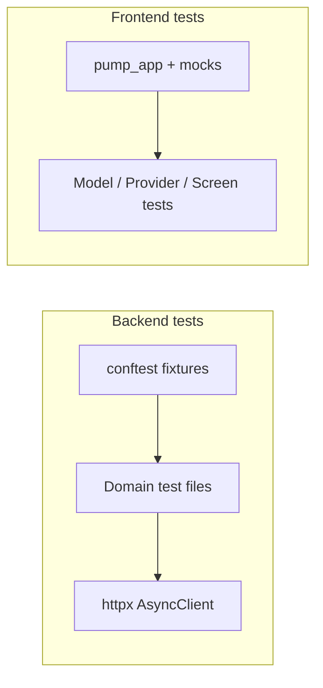

# Backend & Frontend Test Coverage

## Initiator

- **Who:** Developers (run tests locally or in CI); refactoring blueprint (Phase 0 of [3-layer architecture refactor](../planned/3-layer-architecture-refactor.md)).
- **When:** Before refactoring (baseline); after each change to catch regressions; CI pipelines.

## Frontend flow (tests)

- **Location:** `FrontEnd/test/` — helpers, model tests, provider tests, screen/widget tests.
- **Helpers:** `test/helpers/fixtures.dart` (test data factories), `mock_api_service.dart` (mock ApiService for widget tests), `mock_providers.dart` (mock AuthProvider, ConfigProvider, etc.), **mock repositories** (`mock_admin_repository.dart`, `mock_bookmark_repository.dart`, `mock_chat_repository.dart`, `mock_event_repository.dart`, `mock_funding_repository.dart`, **`mock_payment_repository.dart`**, `mock_sponsor_repository.dart`, `mock_ticket_repository.dart`, `mock_user_repository.dart`, `mock_venue_repository.dart`) for provider and screen tests under [75-three-layer-architecture](75-three-layer-architecture.md); mock_api_service replaced by repository mocks where applicable. `pump_app.dart` — wraps a widget in `MaterialApp` with optional provider overrides, generous surface size (1080×1920), and optional `NavigatorObserver`; suppresses RenderFlex overflow in tests.
- **Model tests:** `test/models/` — chat_message, **dashboard**, **discount**, event_form_models, event_image, event, funding, map_event, milestone, **notification_model**, **notification_test**, post, **payment**, **rating**, **receipt**, schedule, sponsor, ticket_strategy, ticket, user, venue (JSON serialization, fromJson/toJson, equality).
- **Provider tests:** `test/providers/` — auth_provider, chat_provider, config_provider, event_provider, notification_provider, theme_provider (state, methods with mocked API).
- **Screen tests:** `test/screens/` — admin_dashboard, bid_chat, bid_management, bookmarked_events, conversations, create_event, edit_event, event_detail, explore_tab, funding_card, global_discounts_screen, home, login, manage_screens, my_events_tab, my_pledges, my_tickets, notification, organizer_dashboard, organizer_sponsors_screen, profile, receipt_screens, register, splash, sponsor_category_templates, sponsor_dashboard, sponsor_onboarding, sponsor_payment_receipt, sponsor_ticket_screen, sponsorship_categories_screen, ticket_sales_screen, ticket_scanner_screen, ticket_tiers_section, venue_screens, waitlist_screen; `widget_test.dart` (default Flutter test). **Widget tests:** `test/widgets/` — calendar_bottom_sheet, event_card, event_map_widget, kyc_section, searchable_dropdown, star_rating, tickets_bottom_sheet.
- **Dependencies:** `mocktail: ^1.0.4`, `network_image_mock: ^2.1.1` in `pubspec.yaml` dev_dependencies.

## Backend flow (tests)

- **Location:** `Backend/tests/` — `conftest.py` (fixtures, mock auth), domain test files.
- **Config:** `pytest.ini`, `conftest.py` — async client, test DB (`TEST_DATABASE_URL`), TRUNCATE isolation, mock Firebase auth (Bearer tokens: `test-admin`, `test-organizer`, `test-organizer2`, `test-customer`, `test-sponsor`).
- **Fixtures (conftest):** `test_users`, `test_venue`, `test_event`, `test_event_approved`, `test_ticket_tier`, `test_ticket_sale`, `test_users_with_sponsor`, `auth_headers_sponsor`, `test_pledge`, `test_registration`, `test_notification`, `test_device_token`, `test_sponsor_profile`, `test_sponsorship_category`, `test_sponsor_bid`, milestone/schedule/image/post/rating/strategy/payment-info fixtures as needed. Fixtures use SQLAlchemy models (Event, TicketTier, TicketSale, Funding, Registration, Notification, DeviceToken, SponsorProfile, SponsorshipCategory, SponsorBid, etc.).
- **Domain test files:** `test_admin.py`, `test_admin_extended.py`, `test_auth_extended.py`, `test_banking.py`, `test_chat.py`, `test_dashboard_chat.py`, `test_dashboard_milestone_coverage.py`, `test_discounts.py`, `test_escrow_coverage.py`, `test_escrow_extended_coverage.py`, `test_event_crud_coverage.py`, `test_event_crud_phase2.py`, `test_event_services.py`, `test_fund_escrow_phase2.py`, `test_funding.py`, `test_funding_coverage.py`, `test_funding_extended.py`, `test_images.py`, `test_lifecycle.py`, `test_migrations.py`, `test_milestones.py`, `test_misc_endpoints.py`, `test_misc_services.py`, `test_notifications.py`, `test_organizers.py`, `test_payment_gateway_coverage.py`, `test_payment_services.py`, `test_posts.py`, `test_public_profiles.py`, `test_ratings.py`, `test_registration.py`, `test_registration_coverage.py`, `test_registration_extended.py`, `test_schedule.py`, `test_sponsor_escrow_coverage.py`, `test_sponsor_payments_coverage.py`, `test_sponsor_services_coverage.py`, `test_sponsors.py`, `test_sponsors_coverage.py`, `test_sponsors_extended.py`, `test_strategies.py`, `test_ticket_escrow_coverage.py`, `test_ticket_pricing_coverage.py`, `test_ticket_services_coverage.py`, `test_tickets_extended.py`, `test_worker_coverage.py` — each covers API endpoints and/or services for that domain (status codes, response shape, auth, edge cases, service-layer behaviour).

## Backend routing

- Tests use `httpx.AsyncClient` against the FastAPI app; auth via `auth_headers_*` fixtures (Bearer token). No dedicated test-only routes.

## Service layer

- Backend tests call API endpoints; business logic is exercised indirectly. Frontend tests use mock API and mock providers to isolate widgets/providers.

## Models and DB

- Backend: Test DB is a separate database; `conftest.py` provides async session and TRUNCATE-based isolation. Fixtures create User, Venue, Event, TicketTier, TicketSale, Funding, Registration, Notification, DeviceToken, SponsorProfile, SponsorshipCategory, SponsorBid, etc.
- Frontend: No DB; fixtures are in-memory Dart objects.

## Recently implemented (3-layer alignment and extended coverage)

- **Backend:** New/expanded test files added to align with 3-layer architecture and broaden coverage: admin_extended, auth_extended; dashboard_chat, dashboard_milestone_coverage; escrow_coverage, escrow_extended_coverage; event_crud_coverage, event_crud_phase2, event_services; fund_escrow_phase2; funding_coverage, funding_extended; misc_services; payment_gateway_coverage, payment_services; registration_coverage, registration_extended; sponsor_escrow_coverage, sponsor_payments_coverage, sponsor_services_coverage, sponsors_coverage; ticket_escrow_coverage, ticket_pricing_coverage, ticket_services_coverage, tickets_extended; worker_coverage. These cover API routes, service-layer behaviour, and edge cases per domain.
- **Frontend:** New screen tests: global_discounts_screen, organizer_sponsors_screen, sponsor_category_templates, sponsor_payment_receipt, sponsor_ticket_screen, sponsorship_categories_screen, ticket_sales_screen, ticket_scanner_screen, waitlist_screen. New widget tests: calendar_bottom_sheet, event_card, event_map_widget, kyc_section, searchable_dropdown, star_rating, tickets_bottom_sheet. Tests use pump_app and mocks for consistent isolation.

## Dependencies

- **Requires:** [Auth](01-auth-users.md) (mock auth in conftest), all feature domains (tests cover their endpoints). **Blueprint:** [planned/3-layer-architecture-refactor.md](../planned/3-layer-architecture-refactor.md) — Phase 0 is “Test Coverage (BEFORE any refactoring)”; this doc describes the implemented Phase 0.

## Prompt

Document **Backend & Frontend Test Coverage** for the Crowd Funding Event app. Backend: `Backend/tests/` with pytest, conftest (async client, test DB, mock Firebase auth for admin/organizer/customer/sponsor), fixtures for events, tickets, funding, registration, notifications, sponsors, milestones, schedule, images, posts, ratings, strategies, payment info; domain test files per API area. Frontend: `FrontEnd/test/` with pump_app (MaterialApp + providers), fixtures, mock API and mock providers, model/provider/screen tests; mocktail and network_image_mock. Tests provide a baseline for safe refactoring (e.g. 3-layer architecture).

## Flow diagram

## Vulnerabilities

- Test DB must not be production; use `TEST_DATABASE_URL` and ensure CI uses an isolated DB. Mock auth tokens must never be valid in production Firebase.

## Improvements

- Add more edge-case and error-path tests per endpoint. Frontend: add integration tests (e.g. full flow with fake API). See planned refactor for Phase 2+ test-after-repository pattern.

## Feedback

- Comprehensive Phase 0 test coverage enables refactoring with confidence; run `pytest -v` (Backend) and `flutter test` (Frontend) after each change.
