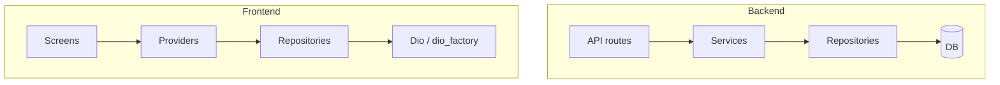

# Three-Layer Architecture

## Initiator

- **Who:** Developers (all new features and refactors); system (every request flows through the layers).
- **When:** Backend: every API request (API → Service → Repository → DB). Frontend: every screen/flow (Screen → Provider → Repository → Dio). Refactoring and new code follow this structure.

## Frontend flow

- **Layers:** **Screen** (UI only; reads from providers, dispatches actions to providers) → **Provider** (state + business logic; uses repositories) → **Repository** (data access; uses Dio from dio_factory, returns domain models or throws ApiError). Screens do not call repositories directly; they use providers. **ApiService** has been removed; repositories use **Dio** from `lib/config/dio_factory.dart` (`createAuthDio()` — base URL, timeouts, Firebase auth interceptor, 401 retry).
- **Repositories:** `lib/repositories/` — `base_repository.dart` (PaginatedResult, ApiError, extractMessage), `admin_repository.dart`, `bookmark_repository.dart`, `chat_repository.dart`, `event_repository.dart`, `funding_repository.dart`, `notification_repository.dart`, **`payment_repository.dart`**, `sponsor_repository.dart`, `ticket_repository.dart`, `user_repository.dart`, `venue_repository.dart`. Each encapsulates API calls for a domain and exposes typed methods.
- **Providers:** Existing (auth, chat, config, event, notification, theme) plus **pledge_provider** (pledge/pledges state and actions). Providers hold repositories (injected or created) and expose state and methods to screens.
- **Screens:** Admin dashboard and tabs, bookmarks, event detail and create/edit, funding card, home tabs, manage screens, profile, sponsor screens, ticket screens, venue screens, etc. — updated to consume providers (and thus repositories) instead of calling ApiService directly where the 3-layer migration is applied.
- **Tests:** `test/helpers/mock_*_repository.dart` (mock_admin_repository, mock_bookmark_repository, mock_chat_repository, mock_event_repository, mock_funding_repository, **mock_payment_repository**, mock_sponsor_repository, mock_ticket_repository, mock_user_repository, mock_venue_repository) for widget and provider tests. Provider and screen tests updated to inject mock repositories. ApiService mock replaced by repository mocks where applicable.

## Backend flow

- **Layers:** **API** (thin: auth, validation, request/response shaping; calls services) → **Service** (business logic; calls repositories, no direct `db.execute` in route handlers) → **Repository** (data layer; all SQLAlchemy queries, returns models or raises). API routes do not query the DB directly; they call service functions. Services call repositories for reads/writes.
- **Repositories:** `app/repositories/` — `base.py` (BaseRepository with get_by_id, get_or_404, create, count, list_paginated), `admin_repo.py`, **`banking_repo.py`**, `dashboard_repo.py`, **`email_template_repo.py`**, `escrow_repo.py`, `event_repo.py`, `funding_repo.py`, **`ledger_repo.py`**, `notification_repo.py`, **`rating_repo.py`**, `registration_repo.py`, `sponsor_repo.py`, `ticket_repo.py`, `user_repo.py`, `venue_repo.py`, **`worker_run_repo.py`**. Each encapsulates DB access for a domain.
- **Services:** `app/services/` — admin, auth, dashboard, escrow, escrow_base, event (attendance, crud, discounts, lifecycle, organizers, permissions, queries), funding (pledges, reservations, summary), kyc_verification, notification_service, registration, sponsor (bids, categories, delegates, organizer_queries, payments, profile, tickets), sponsor_escrow, ticket (pricing, sales, tiers), ticket_escrow, venue; **email_notifications**, **email_service**, **email_templates** and **worker/tasks** use repositories (e.g. email_template_repo, worker_run_repo). Services accept `db: AsyncSession` and repository instances (or obtain them); they contain business rules and orchestration; they do not build raw SQL/select in API handlers.
- **API:** `app/api/v1/` — **admin**, **chat**, **events** (_helpers, crud, images, lifecycle, pledge, reactions, registration, tickets), **notifications**, **public_profiles**, **ratings**, **schedule**, **sponsors** (bids, categories, payments, profile, templates, tickets), **users**, **webhooks** — endpoints refactored to use repository pattern for data access; handlers delegate to services/repositories (no direct SQLAlchemy in routes).

## Backend routing

- No new routes. Existing routes delegate to services; services use repositories for DB access. Read/write session choice (ReadDbSession vs DbSession) remains per project rules and [51-backend-query-improvements](51-backend-query-improvements.md).

## Service layer

- **Backend:** Services are in `app.services.*`. They receive `db` and optionally repositories; they orchestrate business logic and call repositories for persistence. N+1 prevention and eager loading are applied in repository or service layer (selectinload/joinedload in repo queries where needed).
- **Frontend:** Providers are the “service” layer: they hold state and invoke repositories and update state. Repositories are the data layer; they use Dio from dio_factory for HTTP.

## Models and DB

- **Backend:** Models remain in `app.models.*`; repositories read/write them via SQLAlchemy AsyncSession. No schema change for the 3-layer split; only code organization.
- **Frontend:** Models remain in `lib/models/*`; repositories return them (or DTOs) from API responses. `base_repository.dart` provides PaginatedResult and ApiError for consistent handling.

## Recently implemented (repository-pattern refactor)

- **Backend:** API endpoints refactored to use repository methods for data access: admin, chat, events (_helpers, crud, images, lifecycle, pledge, reactions, registration, tickets), notifications, public_profiles, ratings, schedule, sponsors (bids, categories, payments, profile, templates, tickets), users, webhooks. New repositories: **rating_repo.py**, **worker_run_repo.py**. Repositories added/updated: **banking_repo**, **email_template_repo**, **ledger_repo**. Services (email_notifications, email_service, email_templates, kyc_verification) and worker tasks use repositories. Error handling and data retrieval streamlined; event images and ratings centralized through repositories.
- **Frontend:** **ApiService removed**; HTTP is done via **Dio** from `lib/config/dio_factory.dart` (`createAuthDio()` — base URL, timeouts, Firebase auth interceptor, 401 retry). New **payment_repository.dart**. Repositories use the shared Dio instance. Config provider, funding_card, ticket_tiers_section, my_bid_actions, sync_service updated. Tests: **mock_payment_repository.dart** (replacing mock_api_service where applicable); chat_provider, config_provider, and several screen tests updated to use mock repositories.
- **Backend repository methods (flexible data handling):** Repository methods updated to accept additional parameters for flexible multi-field updates. **Banking:** `verify_bank_account(db, account)` — mark organizer bank account verified. **Funding:** `complete_refund(db, funding, gateway_refund_id)`, `update_status(db, funding, status)`. **Escrow, Sponsor, Ticket** repos: new or updated methods for status updates and refund flows. Services (admin, escrow_base, event/crud, event/lifecycle, refund_retry, registration) and worker tasks call these repo methods; sponsors/organizer_views API updated.
- **Frontend models and Event policy:** New domain models: **admin.dart** (admin/user management structures), **dashboard.dart** (dashboard KPIs, event carousel, status chips), **discount.dart** (discount strategies), **notification_model.dart**, **payment.dart**, **rating.dart**, **receipt.dart**. **Event** model enhanced with new policy fields for event management. **Funding, Milestone, Sponsor, Ticket, User** models updated. Providers (admin, config, event, notification, pledge, sponsor, ticket, user) and repositories (admin, event, funding, notification, payment, sponsor, ticket, user) updated to use new models. Admin dashboard, user detail tabs, event screens, dashboard tabs, manage screens, notification screen, profile screens, sponsor screens, and sync_service updated for consistent data handling. New model tests: **dashboard_test**, **discount_test**, **notification_model_test**, **payment_test**, **rating_test**, **receipt_test**; existing model and screen tests updated.

## Dependencies

- **Requires:** [Auth](01-auth-users.md), all feature domains (events, funding, tickets, sponsors, etc.). **Blueprint:** [planned/3-layer-architecture-refactor.md](../planned/3-layer-architecture-refactor.md). **Testing:** [74-test-coverage](74-test-coverage.md) (mock repositories for frontend tests).
- **Triggers / side effects:** None; this is an architectural boundary. New features must add/use repository and service (or provider) layers as per CLAUDE.md and this doc.

## Prompt

Implement and maintain **Three-Layer Architecture** for the Crowd Funding Event app. Backend: API (thin) → Service (business logic) → Repository (DB access); repositories in `app/repositories/` (base, admin, banking, dashboard, email_template, escrow, event, funding, ledger, notification, rating, registration, sponsor, ticket, user, venue, worker_run). Frontend: Screen (UI) → Provider (state + logic) → Repository (API calls via Dio); `lib/config/dio_factory.dart` provides `createAuthDio()`; repositories in `lib/repositories/` (base_repository, admin, bookmark, chat, event, funding, notification, payment, sponsor, ticket, user, venue); ApiService removed; screens use providers. Tests use mock repositories (including mock_payment_repository). Follow the flow and dependencies in this document and in planned/3-layer-architecture-refactor.md.

## Flow diagram

## Vulnerabilities

- Ensure repositories do not contain business rules (only data access); services must enforce validation and rules. Avoid leaking DB or API details into screens.

## Post-audit remediation (latest)

### Backend: Multi-step routes extracted to services

6 routes that had multi-step repo orchestration were extracted into service methods:

| Route file | Extracted to | Service method |
|------------|-------------|----------------|
| `users.py` (pledge receipt) | `user_service.py` | `get_pledge_receipt()` |
| `users.py` (ticket receipt) | `user_service.py` | `get_ticket_receipt()` |
| `users.py` (bookmark toggle) | `user_service.py` | `toggle_bookmark()` |
| `admin.py` (customer/organizer detail) | `admin.py` | `get_user_detail()` |
| `webhooks.py` (dispute created) | `banking_service.py` | `handle_dispute_created_webhook()` |

New service file: `Backend/app/services/user_service.py`

### Frontend: Typed request classes

~52 `Map<String, dynamic>` method parameters across providers/repositories replaced with typed request classes:

- **User domain:** `UpdateProfileRequest`, `UpdatePaymentInfoRequest`, `UpdateBankAccountRequest`
- **Venue domain:** `CreateVenueRequest`, `UpdateVenueRequest`
- **Admin domain:** `ApproveEventRequest`, `SetPolicyOverridesRequest`, `UpdatePlatformAccountRequest`
- **Ticket domain:** `CreateTicketStrategyRequest`, `CreateTicketTierRequest`, `UpdateTicketTierRequest`
- **Discount domain:** `CreateEventDiscountRequest`, `CreateDiscountStrategyRequest`, `CreateEarlyBirdDiscountRequest`, `UpdateEarlyBirdDiscountRequest`
- **Schedule domain:** `CreateScheduleItemRequest`, `UpdateScheduleItemRequest`
- **Event domain:** `AddEventOrganizerRequest`, `EventFilters`
- **Sponsor domain:** `SponsorProfileRequest`, `CreateSponsorshipCategoryRequest`, `UpdateSponsorshipCategoryRequest`, `PlaceBidRequest`, `UpdateBidRequest`, `CreateSponsorCategoryTemplateRequest`, `UpdateSponsorCategoryTemplateRequest`

Pattern: typed class with `const` constructor + `toJson()` → repository calls `.toJson()` at Dio boundary → screens construct typed objects instead of bracket-notation Maps.

### Remaining (low priority)

- ~15 single-repo calls in backend routes (simple CRUD — pragmatic, not violations)
- `events/_helpers.py` SQLAlchemy `inspect` usage (relationship-check logic)
- 1 `Map<String, dynamic>` in WebSocket handler (acceptable — raw WS envelope)

## Improvements

- Migrate any remaining API handlers or screens that still bypass the service/repository or provider/repository layer. Complete repository coverage for all domains; add integration tests that assert layer boundaries.

## Feedback

- Clear separation improves testability (mock repos), swap-ability (e.g. offline cache in repo), and future microservice extraction. See planned refactor doc for phased rollout and verification steps.
