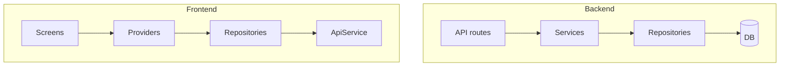

# Three-Layer Architecture

## Initiator

- **Who:** Developers (all new features and refactors); system (every request flows through the layers).
- **When:** Backend: every API request (API → Service → Repository → DB). Frontend: every screen/flow (Screen → Provider → Repository → ApiService). Refactoring and new code follow this structure.

## Frontend flow

- **Layers:** **Screen** (UI only; reads from providers, dispatches actions to providers) → **Provider** (state + business logic; uses repositories and optionally ApiService for raw calls) → **Repository** (data access; calls API, returns domain models or throws ApiError). Screens do not call ApiService or repositories directly; they use providers. Providers use repositories (or ApiService where repos are not yet introduced).
- **Repositories:** `lib/repositories/` — `base_repository.dart` (PaginatedResult, ApiError, extractMessage), `admin_repository.dart`, `bookmark_repository.dart`, `chat_repository.dart`, `event_repository.dart`, `funding_repository.dart`, `notification_repository.dart`, `sponsor_repository.dart`, `ticket_repository.dart`, `user_repository.dart`, `venue_repository.dart`. Each encapsulates API calls for a domain and exposes typed methods.
- **Providers:** Existing (auth, chat, config, event, notification, theme) plus **pledge_provider** (pledge/pledges state and actions). Providers hold repositories (injected or created) and expose state and methods to screens.
- **Screens:** Admin dashboard and tabs, bookmarks, event detail and create/edit, funding card, home tabs, manage screens, profile, sponsor screens, ticket screens, venue screens, etc. — updated to consume providers (and thus repositories) instead of calling ApiService directly where the 3-layer migration is applied.
- **Tests:** `test/helpers/mock_*_repository.dart` (mock_admin_repository, mock_bookmark_repository, mock_chat_repository, mock_event_repository, mock_funding_repository, mock_sponsor_repository, mock_ticket_repository, mock_user_repository, mock_venue_repository) for widget and provider tests. Provider and screen tests updated to inject mock repositories.

## Backend flow

- **Layers:** **API** (thin: auth, validation, request/response shaping; calls services) → **Service** (business logic; calls repositories, no direct `db.execute` in route handlers) → **Repository** (data layer; all SQLAlchemy queries, returns models or raises). API routes do not query the DB directly; they call service functions. Services call repositories for reads/writes.
- **Repositories:** `app/repositories/` — `base.py` (BaseRepository with get_by_id, get_or_404, create, count, list_paginated), `admin_repo.py`, `dashboard_repo.py`, `escrow_repo.py`, `event_repo.py`, `funding_repo.py`, `notification_repo.py`, `registration_repo.py`, `sponsor_repo.py`, `ticket_repo.py`, `user_repo.py`, `venue_repo.py`. Each encapsulates DB access for a domain.
- **Services:** `app/services/` — admin, auth, dashboard, escrow, escrow_base, event (attendance, crud, discounts, lifecycle, organizers, permissions, queries), funding (pledges, reservations, summary), kyc_verification, notification_service, registration, sponsor (bids, categories, delegates, organizer_queries, payments, profile, tickets), sponsor_escrow, ticket (pricing, sales, tiers), ticket_escrow, venue. Services accept `db: AsyncSession` and repository instances (or obtain them); they contain business rules and orchestration; they do not build raw SQL/select in API handlers.
- **API:** `app/api/v1/` — notifications, sponsors (organizer_views, templates), users, venues (and other routers) updated to call service layer; handlers stay thin (parse body, call service, return response).

## Backend routing

- No new routes. Existing routes delegate to services; services use repositories for DB access. Read/write session choice (ReadDbSession vs DbSession) remains per project rules and [51-backend-query-improvements](51-backend-query-improvements.md).

## Service layer

- **Backend:** Services are in `app.services.*`. They receive `db` and optionally repositories; they orchestrate business logic and call repositories for persistence. N+1 prevention and eager loading are applied in repository or service layer (selectinload/joinedload in repo queries where needed).
- **Frontend:** Providers are the “service” layer: they hold state and invoke repositories (or ApiService) and update state. Repositories are the data layer.

## Models and DB

- **Backend:** Models remain in `app.models.*`; repositories read/write them via SQLAlchemy AsyncSession. No schema change for the 3-layer split; only code organization.
- **Frontend:** Models remain in `lib/models/*`; repositories return them (or DTOs) from API responses. `base_repository.dart` provides PaginatedResult and ApiError for consistent handling.

## Dependencies

- **Requires:** [Auth](01-auth-users.md), all feature domains (events, funding, tickets, sponsors, etc.). **Blueprint:** [planned/3-layer-architecture-refactor.md](../planned/3-layer-architecture-refactor.md). **Testing:** [74-test-coverage](74-test-coverage.md) (mock repositories for frontend tests).
- **Triggers / side effects:** None; this is an architectural boundary. New features must add/use repository and service (or provider) layers as per CLAUDE.md and this doc.

## Prompt

Implement and maintain **Three-Layer Architecture** for the Crowd Funding Event app. Backend: API (thin) → Service (business logic) → Repository (DB access); repositories in `app/repositories/` (base, admin, dashboard, escrow, event, funding, notification, registration, sponsor, ticket, user, venue). Frontend: Screen (UI) → Provider (state + logic) → Repository (API calls); repositories in `lib/repositories/` (base_repository, admin, bookmark, chat, event, funding, notification, sponsor, ticket, user, venue); pledge_provider added; screens use providers. Tests use mock repositories. Follow the flow and dependencies in this document and in planned/3-layer-architecture-refactor.md.

## Flow diagram

## Vulnerabilities

- Ensure repositories do not contain business rules (only data access); services must enforce validation and rules. Avoid leaking DB or API details into screens.

## Improvements

- Migrate any remaining API handlers or screens that still bypass the service/repository or provider/repository layer. Complete repository coverage for all domains; add integration tests that assert layer boundaries.

## Feedback

- Clear separation improves testability (mock repos), swap-ability (e.g. offline cache in repo), and future microservice extraction. See planned refactor doc for phased rollout and verification steps.
